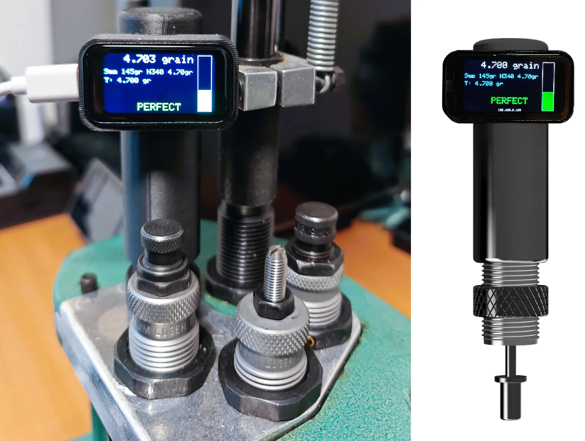

# PowderSense - Open Source Precision Measurement System

**Developer**: Processware  
**License**: CERN-OHL-W (Hardware), MIT (Software), CC BY-SA 4.0 (Documentation)  
**Version**: 1.0  
**Status**: Active Development

---

## 📸 Product Overview

<p align="center">
  
</p>

**PowderSense** mounted on a reloading press, showing real-time precision measurement with visual feedback. The device features a 1.47" color display, WiFi connectivity, and professional PLA-CF enclosure.

---

## 🕹️ Display States

<p align="center">
  
  
  
  
  
</p>

**5 Operational States**:
1. **AP Mode** - Initial WiFi setup (SSID: PowderSense, IP: 192.168.4.1)
2. **No Config** - Connected but no profile loaded (0.000 grain, "No Config")
3. **Measure LOW** - Below target (4.585 gr, Target: 4.700 gr, blue bar)
4. **Measure PERFECT** - Within tolerance (4.700 gr, Target: 4.700 gr, green bar)
5. **Measure HIGH** - Above target (4.802 gr, Target: 4.700 gr, red bar)

---

## 🎯 Project Overview

PowderSense is an open source precision linear displacement measurement system, originally designed for ammunition reloading applications but adaptable for various industrial and educational purposes. The system combines high-precision analog measurement with modern IoT capabilities, providing real-time monitoring, data logging, and web-based configuration.

---

## 🛒 Get PowderSense

### 🔧 Build It Yourself (Open Source)

All design files, firmware, and documentation are freely available:
- **Hardware**: 3D printable enclosure, schematics, PCB files
- **Firmware**: Complete ESP32-C6 source code
- **Documentation**: Assembly guide, BOM, user manual
- **Cost**: ~€55 in components (see [BOM.md](docs/BOM.md))
- **Time**: 4-6 hours assembly + calibration

### 📦 Pre-Built Units (by Processware)

Don't want to build? Get a fully assembled and tested unit:

**PowderSense Assembled**
- €149,- (excl. shipping)
- Fully assembled and tested
- Includes calibration guide (user must calibrate for their specific application)
- Includes USB-C cable
- 1 year warranty
- Email support: info@processware.nl

**What's Included**:
- Complete assembled device
- 3D printed PLA-CF enclosure (matte black)
- Pre-loaded firmware (latest version)
- Calibration guide and quick start instructions
- Access to web-based user manual

**Shipping**:
- Netherlands: €6.95 (PostNL)
- EU: €12.95 (tracked)
- Worldwide: Contact for quote

**Order**: Email info@processware.nl with:
- Quantity
- Shipping address

*Note: Each application requires specific calibration. The device ships ready to power on, but you must perform calibration for your specific use case following the included guide.*

*Note: By purchasing a pre-built unit, you support continued development of this open source project!*

---

### Key Features

- **High Precision**: 0.0146mm theoretical precision using 16-bit ADC (ADS1115)
- **60mm Measurement Range**: Suitable for depth/displacement measurements
- **WiFi Connectivity**: Real-time monitoring via web interface
- **Data Logging**: Persistent storage with CSV export capability
- **Visual Feedback**: 1.47" TFT LCD display (ST7789) with touch interface *(not implemented yet)*
- **Configurable Thresholds**: Customizable alarm settings for quality control
- **Automatic Measurement**: Stability detection for hands-free operation
- **Multiple Configurations**: Store and switch between different measurement profiles
- **OTA Updates**: Over-the-air firmware updates for easy maintenance *(future implementation)*

---

## 🔧 Hardware Components

### Core Components

| Component | Specification | Purpose |
|-----------|--------------|---------|
| Microcontroller | ESP32-C6 (Waveshare LCD 1.47) | Main processor with WiFi |
| Display | 1.47" TFT LCD (ST7789, 172x320) | User interface |
| ADC | ADS1115 (16-bit, I2C) | Precision analog measurement |
| Position Sensor | 10kΩ Slide Potentiometer (60mm) | Linear displacement sensing |

### Recommended Potentiometer

**Bourns PTA6043-2015DPB103**
- Travel: 60mm
- Resistance: 10kΩ
- Linearity: ±0.25%
- Mechanical Life: 1 million cycles

### Bill of Materials (BOM)

See [BOM.md](docs/BOM.md) for complete component list with supplier links and pricing.

---

## 📊 Technical Specifications

| Parameter | Value |
|-----------|-------|
| Measurement Range | 0-60mm |
| Resolution | 0.0146mm (theoretical) |
| Accuracy | ±0.1mm (after calibration) |
| Sampling Rate | 10 Hz (adjustable) |
| Display Update | 10 Hz |
| WiFi | 802.11 b/g/n (2.4GHz) |
| Power Supply | 5V USB-C |
| Operating Temperature | 0-50°C |
| Storage | 4MB Flash (SPIFFS) |
| Connectivity | WiFi, USB Serial |

---

## 🚀 Getting Started

Choose your preferred method:

### Option A: Flash Pre-Built Firmware (Easiest)

**For users who just want to use PowderSense without compiling**:

1. **Download** pre-built firmware from [`releases/v1.0/`](releases/v1.0/)
2. **Install** esptool: `pip install esptool`
3. **Connect** ESP32-C6 board via USB-C
4. **Flash** firmware:
   ```bash
   esptool.py --chip esp32c6 --port COM3 write_flash 0x10000 firmware.bin
   esptool.py --chip esp32c6 --port COM3 write_flash 0x290000 spiffs.bin
   ```
5. **Configure** WiFi and start using!

**See**: [releases/v1.0/FLASHING.md](releases/v1.0/FLASHING.md) for detailed instructions

---

### Option B: Build from Source (For Developers)

**For users who want to modify the code or compile themselves**:

#### Prerequisites

- **PlatformIO** (recommended) or Arduino IDE
- **Visual Studio Code** with PlatformIO extension
- **USB-C cable** for programming
- **WiFi network** for web interface access

#### Build and Flash Guide

#### Step 1: Install Prerequisites (Windows)

1. **Install Visual Studio Code**
   - Download from: https://code.visualstudio.com/
   - Run installer and follow prompts

2. **Install PlatformIO Extension**
   - Open VS Code
   - Click Extensions icon (left sidebar) or press `Ctrl+Shift+X`
   - Search for "PlatformIO IDE"
   - Click "Install" on the official PlatformIO extension
   - Wait for installation to complete (may take a few minutes)
   - Restart VS Code when prompted

3. **Install Git** (if not already installed)
   - Download from: https://git-scm.com/download/win
   - Run installer with default settings

4. **Install USB Drivers** (ESP32-C6)
   - Most modern Windows versions auto-detect USB serial
   - If needed: Download CH340/CP2102 drivers from device manufacturer

#### Step 2: Clone and Open Project

1. **Clone Repository**
   
   **Option A: Using Git Bash**
   ```bash
   git clone https://github.com/me-processware/powdersense.git
   cd powdersense
   ```
   
   **Option B: Using VS Code**
   - Press `Ctrl+Shift+P`
   - Type "Git: Clone"
   - Enter: `https://github.com/me-processware/powdersense.git`
   - Select folder location

2. **Open Project in VS Code**
   - File → Open Folder
   - Navigate to `powdersense` directory
   - Click "Select Folder"
   - PlatformIO will automatically detect `platformio.ini`
   - Wait for PlatformIO to initialize (status bar shows progress)

#### Step 3: Build the Firmware

1. **Select Environment**
   - Click PlatformIO icon in left sidebar (alien head)
   - Expand "esp32c6_touch" environment
   - This is the default for Waveshare ESP32-C6 1.47" LCD

2. **Build Project**
   - Click "Build" under esp32c6_touch environment
   - **OR** click checkmark (✓) icon in bottom status bar
   - **OR** press `Ctrl+Alt+B`
   - Wait for compilation (first build takes longer)
   - Success message: "SUCCESS" in terminal

#### Step 4: Upload to Device

1. **Connect ESP32-C6 Board**
   - Connect USB-C cable to ESP32-C6 board
   - Connect other end to PC
   - Windows should detect device (check Device Manager)
   - Note the COM port (e.g., COM3, COM4)

2. **Upload Firmware**
   - Click "Upload" under esp32c6_touch environment
   - **OR** click arrow (→) icon in bottom status bar
   - **OR** press `Ctrl+Alt+U`
   - PlatformIO auto-detects COM port
   - Wait for upload (progress shown in terminal)
   - Device will reboot automatically

3. **Monitor Serial Output**
   - Click "Monitor" under esp32c6_touch
   - **OR** click plug icon in bottom status bar
   - **OR** press `Ctrl+Alt+S`
   - Baud rate: 115200 (auto-configured)
   - Watch boot messages and WiFi status

#### Step 5: Upload Web Interface Files

1. **Build Filesystem Image**
   - In PlatformIO sidebar
   - Expand "Platform" → "Build Filesystem Image"
   - Click to build SPIFFS image from `data/` folder
   - Wait for completion

2. **Upload Filesystem**
   - Click "Upload Filesystem Image" under Platform
   - **OR** in terminal: `pio run -t uploadfs`
   - This uploads HTML/CSS/JS files to device
   - Takes ~30 seconds
   - Device reboots after upload

#### Step 6: Configure WiFi

1. **Access Point Mode**
   - After first boot, device creates WiFi AP
   - SSID: "PowderSense-XXXX" (XXXX = last 4 MAC digits)
   - Password: "powdersense"

2. **Connect to AP**
   - On your phone/laptop, connect to PowderSense WiFi
   - Captive portal should open automatically
   - If not, navigate to: `http://192.168.4.1`

3. **Configure WiFi**
   - Select your WiFi network from dropdown
   - Enter WiFi password
   - Click "Save Configuration"
   - Device reboots and connects to your network

#### Step 7: Access Web Interface

1. **Find Device IP**
   - Check serial monitor for IP address
   - **OR** check your router's DHCP client list
   - **OR** use network scanner (e.g., Advanced IP Scanner)

2. **Open Web Dashboard**
   - Open web browser (Chrome, Firefox, Edge)
   - Navigate to: `http://<device-ip>`
   - Example: `http://192.168.1.100`
   - Web interface loads

3. **Calibrate and Use**
   - Follow on-screen calibration wizard
   - See [USER_MANUAL.md](docs/USER_MANUAL.md) for details

### Detailed Setup

See [SETUP.md](docs/SETUP.md) for comprehensive installation and configuration instructions.

---

## 📖 Documentation

### User Documentation

- [User Manual](docs/USER_MANUAL.md) - Complete operating instructions
- [Calibration Guide](docs/CALIBRATION.md) - Step-by-step calibration procedure
- [Web Interface Guide](docs/WEB_INTERFACE.md) - Using the web dashboard
- [Troubleshooting](docs/TROUBLESHOOTING.md) - Common issues and solutions

### Developer Documentation

- [Architecture Overview](docs/ARCHITECTURE.md) - System design and structure
- [API Reference](docs/API.md) - WebSocket and HTTP endpoints
- [Hardware Assembly](docs/ASSEMBLY.md) - Physical construction guide
- [Firmware Development](docs/DEVELOPMENT.md) - Contributing to firmware
- [PCB Design](hardware/README.md) - Custom PCB schematics and layout

### Application Notes

- [Reloading Application](docs/applications/RELOADING.md) - Ammunition reloading use case
- [Industrial QC](docs/applications/INDUSTRIAL.md) - Quality control applications
- [3D Printer Integration](docs/applications/3D_PRINTING.md) - Bed leveling and monitoring
- [Educational Use](docs/applications/EDUCATION.md) - Teaching measurement principles

---

## 🏗️ Project Structure

```
powdersense/
├── src/                    # Main source code
│   ├── main.cpp           # Application entry point
│   └── board_config.h     # Board-specific pin definitions
├── include/               # Header files
├── lib/                   # Custom libraries
├── data/                  # Web interface files (SPIFFS)
│   ├── index.html        # Main web dashboard
│   ├── wifi_config.html  # WiFi configuration page
│   └── app.py            # (Optional) Python test server
├── hardware/              # Hardware design files
│   ├── schematics/       # Circuit diagrams
│   ├── pcb/              # PCB layouts (KiCad)
│   └── enclosure/        # 3D printable case (STL)
├── docs/                  # Documentation
├── scripts/               # Utility scripts
├── partitions/            # ESP32 partition tables
├── platformio.ini         # PlatformIO configuration
├── LICENSE-HARDWARE.txt   # CERN-OHL-W license
├── LICENSE-SOFTWARE.txt   # MIT license
└── README.md             # This file
```

---

## 🔐 Licensing

This project uses multiple licenses for different components:

### Hardware (CERN-OHL-W)

All hardware designs, schematics, PCB layouts, and mechanical drawings are licensed under the **CERN Open Hardware License Version 2 - Weakly Reciprocal** (CERN-OHL-W).

**What this means**:
- ✅ You can use, modify, and distribute the hardware design
- ✅ You can manufacture and sell products based on this design
- ✅ You can integrate this design into proprietary products
- ⚠️ Modifications to the hardware design itself must be shared under CERN-OHL-W
- ⚠️ You must provide attribution to the original project

See [LICENSE-HARDWARE.txt](LICENSE-HARDWARE.txt) for full terms.

### Software (MIT)

All firmware, software libraries, and utility scripts are licensed under the **MIT License**.

**What this means**:
- ✅ You can use, modify, and distribute the software
- ✅ You can use it in proprietary products
- ✅ You can sublicense and sell it
- ⚠️ You must include the original copyright notice
- ⚠️ No warranty provided

See [LICENSE-SOFTWARE.txt](LICENSE-SOFTWARE.txt) for full terms.

### Documentation (CC BY-SA 4.0)

All documentation, tutorials, and guides are licensed under **Creative Commons Attribution-ShareAlike 4.0 International** (CC BY-SA 4.0).

**What this means**:
- ✅ You can use, adapt, and share the documentation
- ✅ You can use it for commercial purposes
- ⚠️ You must provide attribution
- ⚠️ Derivative works must use the same license

See [LICENSE-DOCUMENTATION.txt](LICENSE-DOCUMENTATION.txt) for full terms.

### Trademark

The name "PowderSense" and associated logos are trademarks of Processware. You may use them to refer to this project, but not to imply endorsement or create confusion about the source of derivative products.

---

## 🛠️ Development

### Building from Source

**Requirements**:
- PlatformIO Core 6.0+
- ESP32 platform package
- Python 3.7+ (for scripts)

**Build Commands**:
```bash
# Build firmware
pio run -e esp32c6_touch

# Upload firmware
pio run -e esp32c6_touch -t upload

# Upload filesystem
pio run -e esp32c6_touch -t uploadfs

# Monitor serial output
pio device monitor -b 115200

# Clean build
pio run -t clean
```

### Development Workflow

1. Create feature branch: `git checkout -b feature/your-feature`
2. Make changes and test thoroughly
3. Update documentation if needed
4. Commit with clear messages
5. Push and create pull request

### Code Style

- **C++**: Follow Arduino style guide
- **Indentation**: 2 spaces (no tabs)
- **Comments**: Explain why, not what
- **Naming**: camelCase for variables, PascalCase for classes

### Testing

- Verify web interface on multiple browsers
- Check calibration accuracy with known references
- Test WiFi connectivity in different scenarios

---

## 🤝 Contributing

Contributions are welcome! This is an open source project and benefits from community input.

### Ways to Contribute

- **Bug Reports**: Open an issue with detailed reproduction steps
- **Feature Requests**: Describe the use case and proposed solution
- **Code Contributions**: Submit pull requests with improvements
- **Documentation**: Help improve guides and tutorials
- **Hardware Variants**: Share adaptations for different sensors/displays
- **Application Notes**: Document new use cases

### Contribution Guidelines

1. **Search existing issues** before creating new ones
2. **One issue per bug/feature** - don't combine multiple topics
3. **Provide context** - explain why, not just what
4. **Test your changes** - ensure they work on actual hardware
5. **Update documentation** - keep docs in sync with code
6. **Be respectful** - follow code of conduct

See [CONTRIBUTING.md](CONTRIBUTING.md) for detailed guidelines.

---

## 🌍 Community

### Get Help

- **GitHub Issues**: Bug reports and feature requests
- **GitHub Discussions**: Questions, ideas, and general chat
- **Email**: info@processware.nl (for private inquiries)

### Share Your Build

We'd love to see what you create! Share your builds:

- Post photos/videos in GitHub Discussions
- Tag #PowderSense on social media
- Submit to Hackaday.io, Hackster.io
- Write blog posts and tutorials

### Stay Updated

- **Watch** this repository for updates
- **Star** if you find it useful
- **Fork** to create your own variant
- Subscribe to release notifications

---

## 📈 Roadmap

### Current Version (v1.0)

- ✅ Basic measurement and display
- ✅ WiFi configuration and web interface
- ✅ Data logging and CSV export
- ✅ Automatic measurement with stability detection
- ✅ Multiple configuration profiles

### Planned Features (v1.x)

- [ ] OTA implementation
- [ ] touchscreen support

## 🎓 Use Cases

### Primary: Ammunition Reloading

Monitor powder depth in reloading presses to detect under/overcharges, ensuring safety and consistency.

**Benefits**:
- Real-time feedback during reloading
- Automatic detection of anomalies
- Data logging for quality records
- Eliminates manual checking

### Industrial Quality Control

Measure part dimensions, material thickness, or fill levels in manufacturing.

**Benefits**:
- High precision at low cost
- WiFi connectivity for remote monitoring
- Data export for SPC analysis
- Customizable for specific applications

### 3D Printing

Monitor bed level, Z-axis position, or filament diameter.

**Benefits**:
- Automated bed leveling assistance
- Print quality monitoring
- Filament consistency checking
- Integration with OctoPrint/Klipper

### Education

Teach measurement principles, calibration, and data analysis.

**Benefits**:
- Open source for learning
- Affordable for schools
- Hands-on electronics project
- Real-world engineering example

---

## 🏆 Acknowledgments

### Inspiration

This project was inspired by the open source hardware movement and successful projects like:

- **Arduino** - Pioneering open source microcontroller platform
- **Adafruit** - Open source hardware and excellent documentation
- **SparkFun** - Community-driven electronics development

### Libraries Used

- **LovyanGFX** - High-performance graphics library
- **WebSockets** - Real-time communication
- **ArduinoJson** - JSON parsing and serialization
- **Adafruit ADS1X15** - ADC driver

---

## 📞 Support

### Commercial Support

For businesses requiring:
- Custom firmware development
- Hardware adaptations
- Integration services
- Training and consulting
- Priority support

Contact: info@processware.nl

### Consulting Services

Processware offers consulting for:
- Industrial measurement systems
- IoT device development
- ESP32 firmware development
- Open source hardware strategy

---

## ⚖️ Disclaimer

This device is provided as-is for educational and experimental purposes. While designed for precision measurement, it should not be used as the sole safety mechanism in critical applications. 

**For reloading applications**: Always follow safe reloading practices, use published load data, and verify charges with a calibrated scale. This device is a supplementary tool, not a replacement for proper reloading procedures.

**No warranty**: This hardware and software are provided without warranty of any kind. Use at your own risk.

---

## 📄 Citation

If you use this project in academic work, please cite:

```
Processware. (2025). PowderSense: Open Source Precision Measurement System.
GitHub repository: https://github.com/me-processware/powdersense
```

---

**Made with ❤️ by Processware**

*Open Source Hardware • Community Driven • Built for Makers*

---

## 🔗 Links

- **GitHub**: https://github.com/me-processware/powdersense
- **Website**: https://powdersense.nl (TBD)
- **Documentation**: https://docs.powdersense.com (TBD)
- **Hackaday**: https://hackaday.io/project/powdersense (TBD)

---

*Last updated: November 2025*
