# PowderSense - Assembly Guide

**Project**: PowderSense Precision Measurement System  
**Author**: Processware  
**Version**: 1.0  
**Difficulty**: Intermediate  
**Estimated Time**: 2-3 hours  
**Last Updated**: November 2025

---

## ⚠️ Safety First

**Before You Begin**:
- Work in a well-ventilated area (soldering fumes)
- Wear safety glasses when cutting metal
- Use proper tools for each task
- Disconnect power when working on electronics
- Keep a fire extinguisher nearby when soldering

---

## 📋 Prerequisites

### Required Components

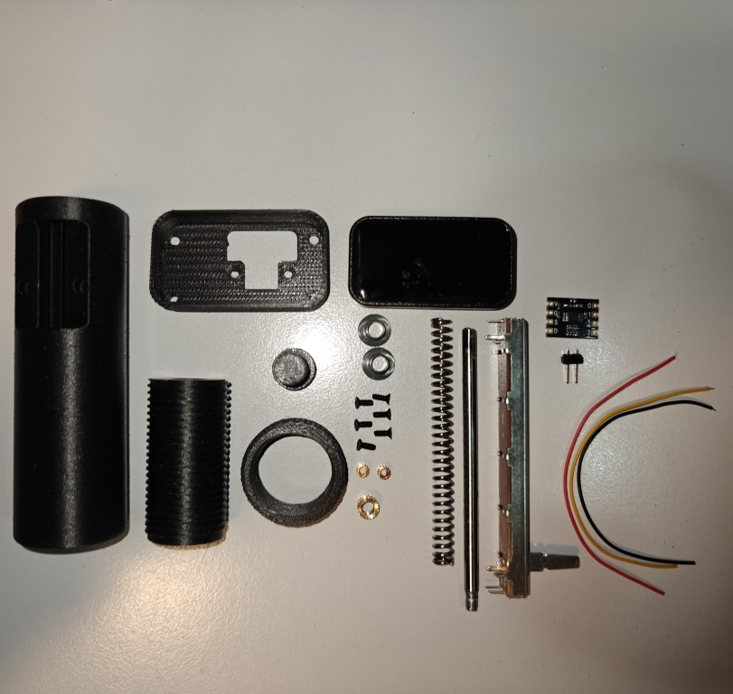
*Photo 1: All components laid out and ready for assembly*

Ensure you have all parts from the [Bill of Materials](BOM.md):
- [ ] ESP32-C6 Development Board (1.47" LCD, NOT soldered version)
- [ ] ADS1115 ADC Module
- [ ] Bourns PTA6043-2015DPB103 Slide Potentiometer (10kΩ)
- [ ] Compression Spring (0.9mm × 5mm × 70mm)
- [ ] Slide Bearings (4mm bore, igus XFM-0405-04) × 2
- [ ] Steel Rod (4mm × 500mm)
- [ ] 3D Printed Enclosure (all parts)
- [ ] Hardware (screws, heat-set inserts)
- [ ] Wire and connectors

### Required Tools

**Essential**:
- Soldering iron (temperature controlled, 300-350°C)
- Solder (60/40 or lead-free)
- Wire strippers
- Flush cutters
- Small screwdrivers (Phillips and flat)
- Multimeter
- Rotary tool (Dremel) with cutting disc (1mm)
- M4 tap and tap wrench
- Helping hands or PCB holder
- Heat gun or lighter (for heat-set inserts)

**Recommended**:
- Digital calipers (for measuring)
- Desoldering pump or wick
- Flux pen
- Isopropyl alcohol (cleaning)
- Small files or sandpaper
- Bench vise or clamp

---

## 🔧 Assembly Overview

The build process consists of these main stages:

1. **Preparation**: 3D printed parts post-processing and heat-set inserts
2. **Rod Preparation**: Cutting, threading, and grooving the steel rod
3. **Potentiometer Modification**: Trimming pins and slider
4. **Mechanical Assembly**: Rod, bearings, spring, and probe
5. **Electronics Assembly**: Wiring and soldering connections
6. **Final Assembly**: Installing in enclosure and testing
7. **Calibration**: Software setup and calibration

**Estimated Time Breakdown**:
- Preparation: 30 minutes
- Rod preparation: 30 minutes
- Potentiometer mod: 20 minutes
- Mechanical assembly: 30 minutes
- Electronics wiring: 45 minutes
- Final assembly: 30 minutes
- Testing & calibration: 30 minutes

---

## 📐 Stage 1: Preparation

### 1.1 3D Printed Parts Post-Processing

**Clean all printed parts**:
1. Remove any support material (if present)
2. Trim stringing or blobs with hobby knife
3. Test-fit all parts together
4. Light sanding (220 grit) on mating surfaces if needed

**Check critical dimensions**:
- Display opening: Should fit 1.47" LCD snugly
- Screw holes: Should be clear and aligned
- Bearing holes: Should fit 4mm rod with bearings

### 1.2 Install Heat-Set Inserts

**Required inserts**:
- 2× M2 inserts in display housing (for mounting to main body)
- 1× M4 insert in 9mm probe (for securing to rod)

**Installation procedure**:
1. Heat soldering iron to 200-220°C
2. Place insert on top of hole (brass side down)
3. Hold iron tip on insert top
4. Apply gentle downward pressure
5. Insert will melt into plastic and sink flush
6. Hold for 2-3 seconds, then remove iron
7. Allow to cool completely (30 seconds)
8. Verify insert is flush and secure

**Tips**:
- Don't overheat (plastic will deform)
- Keep iron perpendicular to surface
- If insert goes too deep, heat and pull out with pliers while hot


*Photo 2: 3D printed parts with heat-set inserts installed and ready for assembly*

---

## 🔩 Stage 2: Rod Preparation

This is the most critical and tricky part of the assembly. Take your time!

### 2.1 Cut Rod to Length

**Required length**: 85mm

**Cutting procedure**:
1. Measure and mark 85mm from one end of steel rod
2. Secure rod in vise or clamp
3. Use Dremel with 1mm cutting disc
4. Cut slowly and steadily (don't force)
5. Let tool do the work (high speed, light pressure)
6. Deburr cut end with file or sandpaper

**Safety**:
- Wear safety glasses (metal particles)
- Secure rod firmly (won't slip)
- Keep hands away from cutting disc

### 2.2 Create Groove for Potentiometer Clamp

**Location**: One end of the 85mm rod  
**Depth**: Approximately 6mm  
**Purpose**: Clamps around potentiometer slider

**Grooving procedure**:
1. Mark 6mm from one end of rod
2. Secure rod in vise (groove end up)
3. Use Dremel with 1mm cutting disc
4. Cut groove perpendicular to rod axis
5. Depth: approximately 1.5-2mm (creates a slot)
6. Test fit on potentiometer slider
7. Adjust depth if needed for tight fit

**Result**: You should have a slot that can clamp onto the potentiometer slider mechanism.

### 2.3 Thread the Opposite End

**Location**: Opposite end from groove (other end of 85mm rod)  
**Thread**: M4 × 0.7mm pitch  
**Length**: Approximately 5mm

**Threading procedure**:
1. Secure rod vertically in vise (thread end up)
2. Apply cutting oil or WD-40 to rod end
3. Start M4 tap perpendicular to rod
4. Turn tap 1/4 turn clockwise
5. Back off 1/8 turn (breaks chips)
6. Repeat until 5mm depth achieved
7. Clean threads with brush
8. Test fit with M4 screw

**Tips**:
- Keep tap perfectly straight (critical!)
- Use plenty of cutting fluid
- Don't force (tap will break)
- If resistance increases, back out and clean chips

---

## 🎛️ Stage 3: Potentiometer Modification

The Bourns potentiometer needs modification to fit in the tight enclosure.

### 3.1 Trim Solder Pins

**All three pins must be trimmed as short as possible**:

1. Use flush cutters to trim pins
2. Cut as close to plastic body as possible
3. Leave approximately 1-2mm of pin
4. File smooth if needed
5. Clean any plastic burrs

**Why**: The potentiometer is a tight fit in the enclosure, long pins will interfere.

### 3.2 Trim Slider Height

**Remove approximately the height of the markings**:

1. Identify the slider mechanism (moving part)
2. Measure height of manufacturer markings
3. Use flush cutters or small saw
4. Cut slider to reduce height by ~2-3mm
5. File smooth to prevent snagging
6. Test travel (should move smoothly)

**Why**: Reduces overall height for better fit in enclosure.

### 3.3 Solder Wire to Pin 3 (Ground)

**Before installing in enclosure**:

1. Cut 15cm of wire (black recommended)
2. Strip 3mm from one end
3. Tin wire end and Pin 3 (one end pin)
4. Solder wire to Pin 3
5. Add heat shrink tubing if desired

**Why**: Pin 3 must be soldered before potentiometer is installed, as it will be inaccessible later.

**Pin identification** (looking at solder side):
```
Pin 1 [●]────────[●] Pin 3 (Ground) ← Solder wire here
        [●]
       Pin 2 (Wiper/Signal)
```

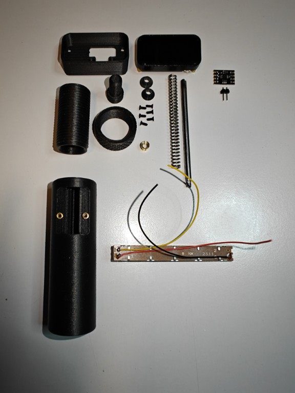
*Photo 3: Potentiometer with wires soldered to all three pins*

---

## ⚙️ Stage 4: Mechanical Assembly

### 4.1 Install Slide Bearings

**Location**: Main body housing

1. Insert first bearing into lower bearing hole
2. Press firmly until seated
3. Insert second bearing into upper bearing hole
4. Verify bearings are aligned (rod should slide through)
5. Test fit with rod (smooth motion)

### 4.2 Attach Rod to Potentiometer

**This requires care and patience**:

1. **Position potentiometer** in main body (don't fully insert yet)
2. **Align grooved end of rod** with potentiometer slider
3. **Clamp rod groove** around slider mechanism
   - The groove should grip the slider firmly
   - May require slight bending/squeezing of rod end
   - Use pliers if needed to tighten grip
4. **Carefully guide Pin 3 wire** through cable duct
   - Route wire along inside of enclosure
   - Avoid pinching wire
5. **Slide potentiometer** into position
   - Don't push all the way in yet
   - Leave accessible for soldering Pins 1 and 2

**Check**: Rod should move potentiometer slider when pushed/pulled.

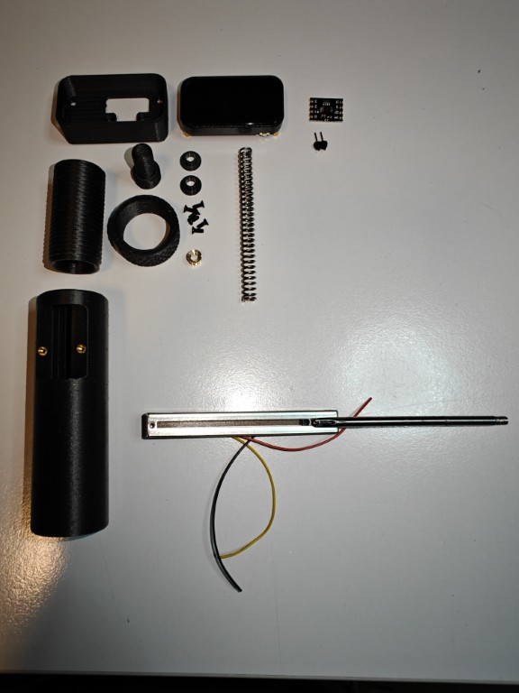
*Photo 4: Rod with grooved end clamped to potentiometer slider, wires attached*

### 4.3 Solder Pins 1 and 2

**Now that potentiometer is positioned**:

1. Cut two wires (~3 to 4cm each):
   - Red wire for Pin 1 (VCC)
   - Yellow/Green wire for Pin 2 (Signal)
2. Strip and tin wire ends
3. Solder red wire to Pin 1 (opposite end from Pin 3)
4. Solder yellow wire to Pin 2 (center pin)
5. Route wires through cable ducts

**Verify connections**:
- Pin 1: VCC (red wire)
- Pin 2: Signal/Wiper (yellow wire)  
- Pin 3: Ground (black wire, already soldered)

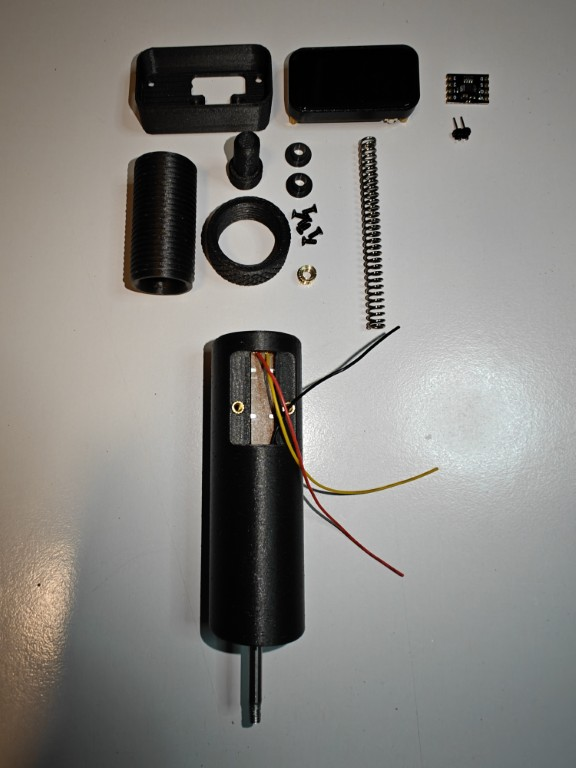
*Photo 5: Rod and potentiometer installed in housing with all wires routed*

### 4.4 Secure Potentiometer with Probe Die

**Lock everything in place**:

1. Thread M4 probe die onto threaded end of rod
2. Screw in until it contacts potentiometer housing
3. This clamps potentiometer firmly in position
4. Verify potentiometer cannot move
5. Test rod travel (should be smooth, but becarefull not all of 60mm range is usuable)

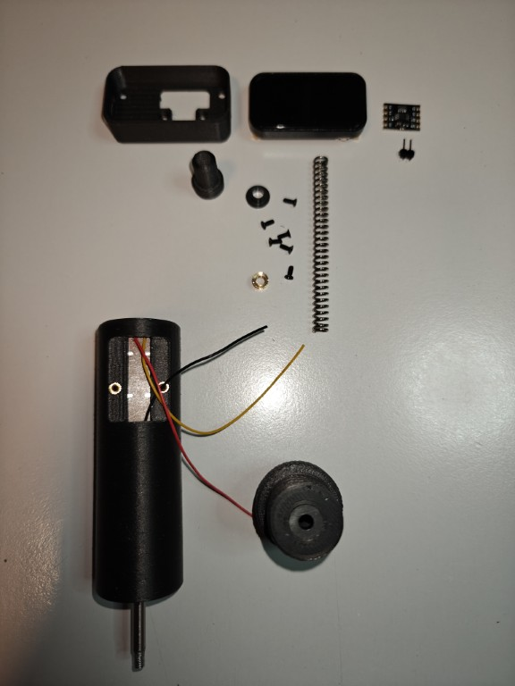
*Photo 6: Probe die threaded onto rod, securing potentiometer in position*

### 4.5 Install Spring and Probe

**Final mechanical assembly**:

1. **Slide compression spring** over rod
   - Spring should rest against probe die
2. **Attach 9mm probe** to threaded rod end
   - Screw into M4 insert (installed in Stage 1)
   - Tighten securely but don't over-tighten
3. **Test spring action**:
   - Push probe in (should compress spring)
   - Release (should return smoothly)
   - Check for binding or rough spots

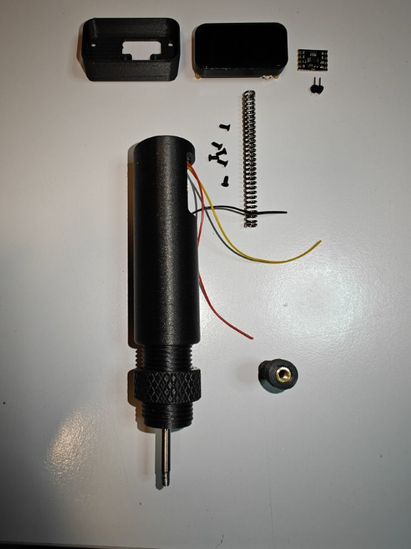
*Photo 9: Spring installed over rod with probe attached*

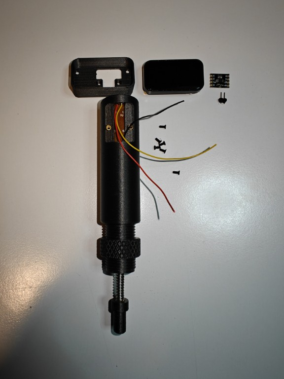
*Photo 10: Complete mechanical assembly - rod, bearings, spring, probe, and potentiometer*

**Result**: Complete mechanical measurement assembly!

---

## 🔌 Stage 5: Electronics Assembly

### 5.1 Wiring Overview

**Connection summary**:

**Potentiometer to ADS1115**:
- Pin 1 (VCC) → 3.3V on ADS1115
- Pin 2 (Wiper) → A0 on ADS1115
- Pin 3 (GND) → GND on ADS1115

**ADS1115 to ESP32-C6**:
- VCC → VBUS (5V) or 3.3V
- GND → GND
- SCL → SCL (I2C clock)
- SDA → SDA (I2C data)

### 5.2 Potentiometer Wiring

**Connect potentiometer to ADS1115**:

1. **Pin 1 (Red wire) to 3.3v on board
   - This provides 3.3V reference voltage

2. **Pin 2 (Yellow wire) to ADS1115 A0**:
   - Solder yellow wire to A0 input
   - This is the analog signal from potentiometer

3. **Pin 3 (Black wire) to ADS1115 GND**:
   - Solder black wire to GND on ADS1115
   - Completes the voltage divider circuit

**Verify connections with multimeter**:
- Resistance between Pin 1 and Pin 3: ~10kΩ
- Resistance Pin 1 to Pin 2: 0-10kΩ (varies with position)
- Resistance Pin 2 to Pin 3: 10kΩ-0 (varies with position)

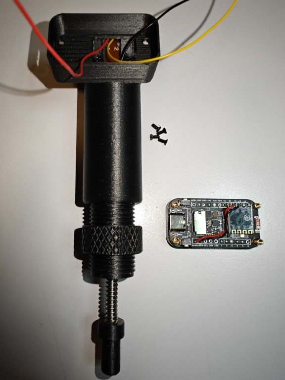
*Photo 11: ESP32-C6 board with potentiometer wiring connected*

### 5.3 ADS1115 to ESP32-C6 Wiring

**I2C Communication**:

1. **VCC → VBUS or 3.3V**:
   - Red wire from ADS1115 VCC
   - To VBUS (5V) or 3.3V on ESP32-C6
   - **Recommended**: Use VBUS for better ADC reference

2. **GND → GND**:
   - Black wire from ADS1115 GND
   - To any GND pin on ESP32-C6

3. **SCL → SCL**:
   - Wire from ADS1115 SCL
   - To SCL pin on ESP32-C6 (check board pinout)
   - **Default**: GPIO5 (verify in `board_config.h`)

4. **SDA → SDA**:
   - Wire from ADS1115 SDA
   - To SDA pin on ESP32-C6 (check board pinout)
   - **Default**: GPIO4 (verify in `board_config.h`)

**Board-specific notes**:
- Touch version: I2C pins may differ
- RGB version: I2C pins may differ
- Consult `src/board_config.h` for exact pin assignments

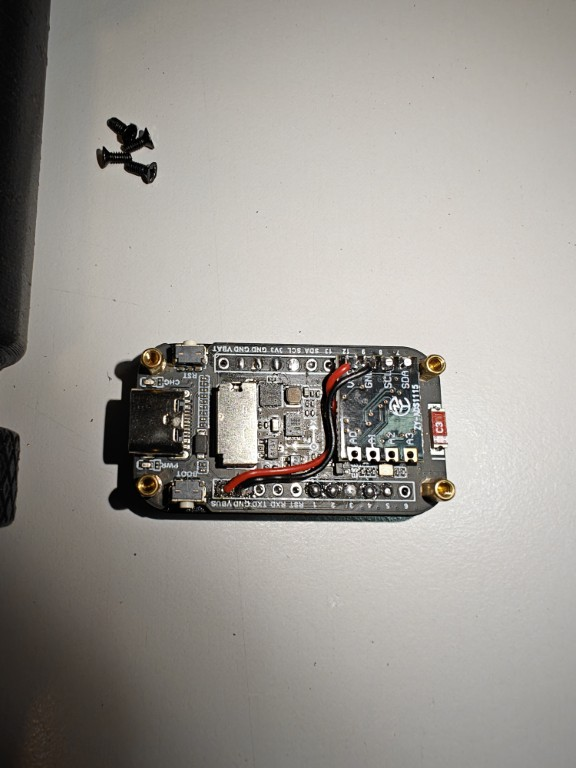
*Photo 12: Close-up of ESP32-C6 board showing wiring connections*

### 5.4 Soldering Best Practices

**For clean, reliable connections**:

1. **Tin all surfaces first**:
   - Apply solder to wire
   - Apply solder to pad/pin
   
2. **Heat both surfaces**:
   - Touch iron to both wire and pad
   - Apply solder to joint (not iron)
   
3. **Use proper solder amount**:
   - Enough to fill joint
   - Not so much it creates bridges
   
4. **Inspect each joint**:
   - Shiny, smooth surface (good)
   - Dull, grainy surface (cold joint, reheat)
   - Solder balls or bridges (clean and redo)

5. **Strain relief**:
   - Use hot glue for mechanical support
   - Avoid stress on solder joints

### 5.5 Testing Electronics

**Before final assembly, test all connections**:

1. **Visual inspection**:
   - Check for solder bridges
   - Verify all connections made
   - Look for cold joints

2. **Continuity test** (multimeter):
   - Verify each wire connection
   - Check for shorts between adjacent pins
   - Confirm GND connections

3. **Power test**:
   - Connect USB-C to ESP32-C6
   - Check for smoke heated up components, or unusual smells (disconnect if present!)
   - Verify board powers on (LED or display)

4. **I2C test** (optional, requires firmware):
   - Upload test firmware
   - Run I2C scanner
   - Verify ADS1115 detected at 0x48

---

## 📦 Stage 6: Final Assembly

### 6.1 Install Display

**Attach LCD to display housing**:

1. Carefully insert 1.47" TFT LCD into display bezel
2. Ensure screen is centered in cutout
3. Test display (upload firmware, verify image)

**Secure display** (choose one method):
- **Screws**: Use M2
- **Adhesive**: Use CA glue or double-sided tape (permanent)

### 6.2 Install ESP32-C6 Board

**Mount in main housing**:

1. Route display ribbon cable through opening
2. Position ESP32-C6 board in mounting area
3. Align mounting holes
4. Secure with screws
5. Ensure no wires are pinched

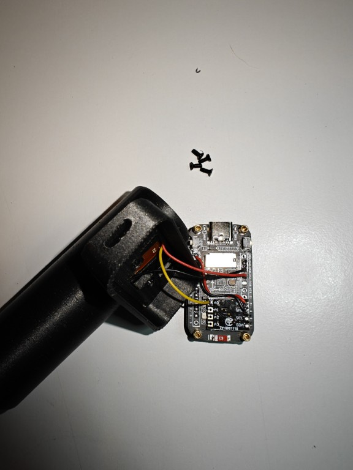
*Photo 13: ESP32-C6 board installed in main housing with all wiring*

### 6.3 Cable Management

**Organize internal wiring**:

1. Route all wires through designated cable ducts
2. Use cable ties or twist ties for bundling
3. Ensure no wires interfere with moving parts (rod, spring)
4. Leave some slack for movement
5. Hot glue wires for strain relief (optional)

### 6.4 Close Enclosure

**Final assembly steps**:

1. **Attach display housing to main body**:
   - Align screw holes
   - Insert M2 screws into heat-set inserts
   - Tighten evenly (don't over-tighten)

2. **Verify functionality before sealing**:
   - Power on device
   - Check display shows correctly
   - Test probe movement (should update display)
   - Verify all functions work

3. **Final enclosure assembly**:
   - Align top and bottom housing
   - Ensure all cables are inside
   - Insert M3 × 8mm screws
   - Tighten in cross pattern
   - Do not over-tighten (risk cracking plastic)

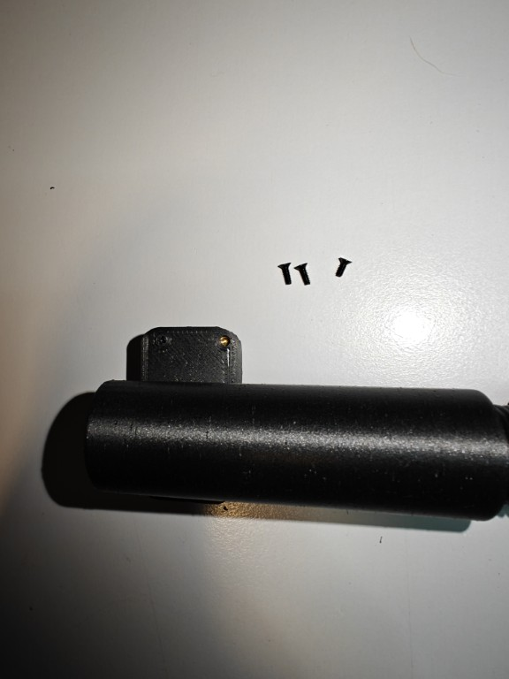
*Photo 14: Enclosure closed and ready for testing*

---

## ✅ Stage 7: Testing & Verification

### 7.1 Power-On Test

**First boot**:

1. Connect USB-C cable
2. Device should power on immediately
3. Display should show startup screen
4. Check for any error messages

**If device doesn't power on**:
- Check USB cable (try different cable)
- Verify USB port provides power
- Check for shorts in wiring
- Inspect solder joints

### 7.2 Functional Test

**Test each function**:

1. **Display**: Should show measurement screen
2. **Probe movement**: Push probe in/out, values should change
3. **WiFi**: Device should create AP or connect to network
4. **Web interface**: Access via browser
5. **Touch/Buttons**: Test user input (if applicable)

### 7.3 Measurement Test

**Verify measurement accuracy**:

1. **Zero position**: Fully extend probe, note reading
2. **Full travel**: Fully compress probe, note reading
3. **Range**: Should be approximately 60mm
4. **Smoothness**: Move probe slowly, values should change smoothly
5. **Repeatability**: Return to same position, should read same value

**If readings are erratic**:
- Check potentiometer connections
- Verify ADS1115 is detected (I2C scan)
- Check for loose wires
- Ensure good solder joints

### 7.4 Calibration

**See [CALIBRATION.md](CALIBRATION.md) for detailed instructions**:

1. Access web interface and create a reload profile
2. Navigate to calibration page
3. Follow two-step calibration:
   - Step 1: Zero point (probe fully extended)
   - Step 2: insert case with exact amount of grains (use precision scale)
4. Save calibration
5. Verify accuracy with test measurements

---

## 🛠️ Troubleshooting

### Common Issues and Solutions

#### Issue: Rod doesn't move smoothly

**Possible causes**:
- Bearings not aligned
- Rod not straight
- Binding in enclosure

**Solutions**:
- Remove rod and check bearing alignment
- Verify rod is straight (roll on flat surface)
- Check for plastic deformation in enclosure
- Lubricate bearings with dry lubricant

#### Issue: Potentiometer doesn't respond

**Possible causes**:
- Wiring incorrect
- Solder joint failed
- Potentiometer damaged

**Solutions**:
- Verify wiring with multimeter
- Check resistance between pins (should be ~10kΩ)
- Resolder connections
- Test potentiometer separately

#### Issue: ADS1115 not detected

**Possible causes**:
- I2C wiring incorrect
- Wrong I2C address
- Faulty module

**Solutions**:
- Verify SCL/SDA connections
- Run I2C scanner (should show 0x48)
- Check for solder bridges on ADS1115
- Try different ADS1115 module

#### Issue: Display not working

**Possible causes**:
- Ribbon cable not connected
- Wrong board variant in firmware
- Display damaged

**Solutions**:
- Reconnect ribbon cable firmly
- Verify correct environment in platformio.ini
- Upload test firmware
- Check display separately

#### Issue: Measurements drift or jump

**Possible causes**:
- Poor solder joints
- Electrical noise
- Loose connections

**Solutions**:
- Reflow all solder joints
- Add capacitor across potentiometer (0.1µF)
- Shorten wire lengths
- Use shielded cable for potentiometer

---

## 💡 Tips & Tricks

### From the Designer

**Rod preparation**:
- The groove depth is critical - too shallow and it won't grip, too deep and rod weakens
- Test fit frequently while cutting groove
- Use cutting oil when threading - makes huge difference

**Potentiometer installation**:
- Take your time with this step - it's the trickiest part
- The "ingenuity" mentioned is finding the right angle to insert potentiometer while routing wire
- Don't force anything - if it doesn't fit, check what's interfering

**Soldering**:
- Use flux! Makes soldering much easier
- Clean tip frequently
- Let joints cool naturally (don't blow on them)

**Testing**:
- Test at each stage - don't wait until end
- Much easier to debug incrementally
- Take notes of any issues encountered

### Community Improvements

**Have you found a better way?**
- Share in GitHub Discussions
- Submit pull request with documentation updates
- Help improve the design for everyone!

---

## 🔄 Revision & Improvements

### Known Areas for Improvement

**Current design challenges**:
1. Rod preparation requires precision tools (Dremel, tap)
2. Potentiometer installation is fiddly
3. Wire routing in tight spaces

**Future improvements** (community suggestions welcome):
- Custom PCB to simplify wiring
- Alternative rod attachment method
- Larger enclosure for easier assembly
- Snap-fit parts instead of screws

**Your ideas?** Open an issue or discussion on GitHub!

---

## 📞 Need Help?

**Stuck during assembly?**

- **GitHub Issues**: Technical problems
- **GitHub Discussions**: Assembly questions
- **Email**: info@processware.nl

**Share your build!**
- Post progress photos
- Document any modifications
- Help others by sharing your experience

---

## ✅ Assembly Checklist

### Pre-Assembly
- [ ] All components received and verified
- [ ] 3D printed parts completed
- [ ] Tools gathered
- [ ] Workspace prepared

### Stage 1: Preparation
- [ ] 3D printed parts cleaned
- [ ] Heat-set inserts installed (M2 × 2, M4 × 1)
- [ ] All parts test-fitted

### Stage 2: Rod Preparation
- [ ] Rod cut to 85mm length
- [ ] Groove cut (6mm deep, one end)
- [ ] M4 thread cut (5mm deep, opposite end)
- [ ] Threads tested with screw

### Stage 3: Potentiometer Modification
- [ ] Solder pins trimmed short
- [ ] Slider height reduced
- [ ] Wire soldered to Pin 3 (ground)

### Stage 4: Mechanical Assembly
- [ ] Slide bearings installed
- [ ] Rod attached to potentiometer (groove clamped)
- [ ] Pin 3 wire routed through cable duct
- [ ] Pins 1 and 2 soldered
- [ ] Probe die secured
- [ ] Spring installed
- [ ] 9mm probe attached
- [ ] Smooth travel verified

### Stage 5: Electronics Assembly
- [ ] Potentiometer wired to ADS1115
- [ ] ADS1115 wired to ESP32-C6
- [ ] All solder joints inspected
- [ ] Continuity tested
- [ ] Power test passed

### Stage 6: Final Assembly
- [ ] Display installed and tested
- [ ] ESP32-C6 board mounted
- [ ] Cables organized
- [ ] Display housing attached
- [ ] Enclosure closed

### Stage 7: Testing
- [ ] Power-on successful
- [ ] Display working
- [ ] Probe movement detected
- [ ] WiFi functional
- [ ] Web interface accessible
- [ ] Calibration completed
- [ ] Accuracy verified

### Documentation
- [ ] Photos taken
- [ ] Issues documented
- [ ] Improvements noted
- [ ] Build shared with community

---

**Congratulations!** You've built your own PowderSense precision measurement system! 🎉

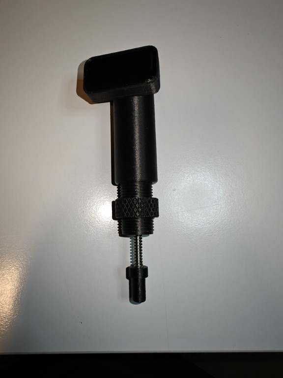
*Photo 15: Your completed PowderSense precision measurement device*

---

*Assembly guide by Processware - November 2025*  
*Part of the PowderSense Open Source Project*

**Feedback welcome!** Help me improve this guide by sharing your build experience.
