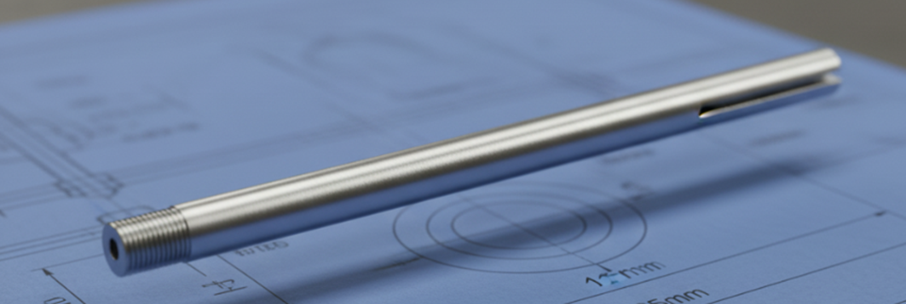

# PowderSense - Bill of Materials (BOM)

**Project**: PowderSense Precision Measurement System  
**Designer**: Processware  
**Version**: 1.0  
**Last Updated**: November 2025  
**Currency**: EUR (€)

---

## 📋 Complete Parts List

This document lists all components required to build one complete PowderSense unit. Prices are approximate and may vary based on supplier, quantity, and location.

---

## 🔌 Electronics Components

### Main Components

| # | Component | Specification | Qty | Unit Price | Total | Supplier | Part Number / Link |
|---|-----------|---------------|-----|------------|-------|----------|-------------------|
| 1 | **ESP32-C6 Development Board** | 1.47" LCD, Touch version, **NOT soldered** | 1 | €15.00 | €15.00 | AliExpress | [Link](https://nl.aliexpress.com/item/1005007751726345.html) |
| 2 | **ADS1115 ADC Module** | 16-bit, I2C, Low power | 1 | €3.50 | €3.50 | AliExpress | ZY-ADS1115 [Link](https://nl.aliexpress.com/item/1005008882714064.html) |
| 3 | **Slide Potentiometer** | 10kΩ, 60mm travel, Linear | 1 | €12.99 | €12.99 | Conrad | Bourns PTA6043-2015DPB103 [Link](https://www.conrad.nl/nl/p/bourns-schuifpotmeter-10-k-0-25-w-lineair-1-stuk-s-2996439.html) |

**Electronics Subtotal**: €31.49

### Notes on Main Components

**ESP32-C6 Board**:
- ⚠️ **Important**: Order the **NOT soldered** version for easier assembly
- Touch functionality exists but is not enabled in current firmware
- Includes integrated 1.47" ST7789 TFT LCD (172x320 pixels)
- USB-C for programming and power

**ADS1115 Module**:
- Provides 16-bit precision (vs 12-bit internal ESP32 ADC)
- I2C interface (address 0x48 default)
- Programmable gain amplifier (PGA)
- Essential for achieving 0.0146mm theoretical resolution

**Potentiometer**:
- Bourns PTA6043-2015DPB103 is the recommended model
- 60mm travel distance
- ±0.25% linearity
- 1 million cycle mechanical life

![Bourns Slide Potentiometer] with cut legs example: (images/bourns_potentiometer.png)
*Bourns PTA6043-2015DPB103 - 10kΩ 60mm linear slide potentiometer*

---

## ⚙️ Mechanical Components

### Motion System

| # | Component | Specification | Qty | Unit Price | Total | Supplier | Part Number / Link |
|---|-----------|---------------|-----|------------|-------|----------|-------------------|
| 4 | **Compression Spring** | 0.9mm wire × 5mm OD × 70mm length | 1 | €1.50 | €1.50 | AliExpress | [Link](https://nl.aliexpress.com/item/1005007124937621.html) |
| 5 | **Slide Bearings** | 4mm bore diameter, igus XFM-0405-04 | 2 | €2.50 | €5.00 | Conrad | igus XFM-0405-04 [Link](https://www.conrad.nl/nl/p/igus-xfm-0405-04-glijlager-boordiameter-4-mm-1416628.html) |
| 6 | **Steel Rod** | 4mm diameter × 500mm length, silver steel | 1 | €4.99 | €4.99 | Conrad | Reely 237060 [Link](https://www.conrad.nl/nl/p/zilverstalen-as-reely-o-x-l-4-mm-x-500-mm-237060.html) |

**Mechanical Subtotal**: €11.49

### Notes on Mechanical Components

**Spring**:
- Provides return force for measurement probe
- 0.9mm wire diameter ensures adequate force without being too stiff
- 70mm length allows for full 60mm travel plus compression

**Slide Bearings**:
- igus polymer bearings are self-lubricating and maintenance-free
- 4mm bore matches steel rod diameter
- Low friction for smooth measurement

**Steel Rod**:
- 500mm length provides material for probe shaft (cut to length)
- Silver steel is precision ground and hardened
- 4mm diameter is standard and readily available
- **Cutting**: Cut to 85mm length with Dremel
- **Threading**: M4 thread on one end (~5mm deep)
- **Grooving**: 6mm groove on other end for potentiometer attachment

*4mm steel rod with M4 threading - ready for assembly*

---

## 🔩 Hardware & Fasteners

### Assembly Hardware

| # | Component | Specification | Qty | Unit Price | Total | Supplier | Notes |
|---|-----------|---------------|-----|------------|-------|----------|-------|
| 7 | **M3 × 8mm Screws** | Pan head or button head | 4 | €0.10 | €0.40 | Local hardware | Case assembly |
| 8 | **M3 × 6mm Screws** | Pan head | 4 | €0.10 | €0.40 | Local hardware | Display bezel |
| 9 | **M2.5 × 6mm Screws** | Pan head | 4 | €0.10 | €0.40 | Local hardware | PCB mounting |
| 10 | **M3 Heat-Set Inserts** | 4mm OD × 5mm length | 4 | €0.15 | €0.60 | AliExpress/Amazon | Optional, recommended |

**Hardware Subtotal**: €1.80

### Wiring & Connectors

| # | Component | Specification | Qty | Unit Price | Total | Supplier | Notes |
|---|-----------|---------------|-----|------------|-------|----------|-------|
| 11 | **Dupont Jumper Wires** | Female-Female, 20cm | 10 | €0.05 | €0.50 | AliExpress | Prototyping |
| 12 | **Silicone Wire** | 22-24 AWG, various colors | 2m | €1.00/m | €2.00 | AliExpress | Permanent wiring |
| 13 | **Heat Shrink Tubing** | Assorted sizes | 10 pcs | €0.05 | €0.50 | AliExpress | Wire protection |
| 14 | **USB-C Cable** | 1m, data + power | 1 | €3.00 | €3.00 | Local electronics | Programming/Power |

**Wiring Subtotal**: €6.00

---

## 🖨️ 3D Printed Parts

### Enclosure Components

| # | Component | Material | Qty | Material Used | Est. Cost | Print Time | Notes |
|---|-----------|----------|-----|---------------|-----------|------------|-------|
| 15 | **Complete Enclosure** | PETG or PLA | 1 set | ~130-150g | €3.00-5.00 | 6-8 hours | See `hardware/enclosure/` |

**3D Printing Subtotal**: €4.00 (average)

### Notes on 3D Printing

**Material Recommendations**:
- **PETG** (preferred): Better temperature resistance, durability
- **PLA**: Easier to print, adequate for indoor use
- **Not recommended**: ABS (warping, fumes)

**Filament Cost Calculation**:
- PETG: ~€20/kg → 150g = €3.00
- PLA: ~€18/kg → 150g = €2.70

**Print Files**:
- Download from `hardware/enclosure/powdersense_main_offset_displayv2.3mf`
- See [hardware/enclosure/README.md](../hardware/enclosure/README.md) for detailed printing instructions

---

## 💰 Cost Summary

### Total Component Cost

| Category | Subtotal |
|----------|----------|
| Electronics Components | €31.49 |
| Mechanical Components | €11.49 |
| Hardware & Fasteners | €1.80 |
| Wiring & Connectors | €6.00 |
| 3D Printed Parts | €4.00 |
| **TOTAL (per unit)** | **€54.78** |

### Cost Breakdown by Source

| Supplier | Approximate Cost | Shipping | Notes |
|----------|------------------|----------|-------|
| AliExpress | €20.00 | €0-5 | Electronics, spring, wire |
| Conrad.nl | €22.98 | €5.95 | Potentiometer, bearings, rod |
| Local Hardware | €2.20 | €0 | Screws and fasteners |
| 3D Printing | €4.00 | €0 | Self-printed |
| **TOTAL** | **€49.18** | **€5.95** | **€55.13 including shipping** |

## 🛒 Purchasing Guide

### Recommended Order Strategy

**Option 1: All-in-One (Fastest)**
- Order all AliExpress items in one order (combined shipping)
- Order Conrad items separately (faster EU shipping)
- Local hardware from nearby store

**Option 2: Budget-Focused (Cheapest)**
- Wait for AliExpress sales (11.11, Black Friday)
- Order larger quantities for discounts
- Source alternatives from local suppliers

**Option 3: Quick Start (Fastest Build)**
- Order only Conrad items first (2-3 day delivery)
- Use temporary wiring while waiting for AliExpress
- 3D print enclosure while waiting

### Lead Times

| Supplier | Typical Delivery | Express Option |
|----------|------------------|----------------|
| AliExpress | 2-4 weeks | 1-2 weeks (+€5-10) |
| Conrad.nl | 2-3 days | Next day (+€7.95) |
| Local Hardware | Same day | N/A |

---

## 🔄 Alternative Components

### Budget Alternatives

**Lower Cost Options** (saves ~€10):

| Original | Alternative | Savings | Trade-off |
|----------|-------------|---------|-----------|
| Bourns potentiometer | Generic 10kΩ slide pot | €8 | Lower quality, less precise |
| igus bearings | Bronze bushings | €3 | More friction, needs lubrication |
| PETG filament | PLA filament | €1 | Less durable |

**Total with alternatives**: ~€45/unit

### Premium Alternatives

**Higher Quality Options** (adds ~€15):

| Original | Alternative | Cost | Benefit |
|----------|-------------|------|---------|
| Generic spring | Precision compression spring | +€3 | More consistent force |
| Steel rod | Hardened ground shaft | +€5 | Better precision, corrosion resistant |
| Standard wire | Shielded cable | +€5 | Better noise immunity |
| Standard screws | Stainless steel hardware | +€2 | Corrosion resistant |

**Total with premium parts**: ~€70/unit

### Sensor Alternatives

**Different Measurement Methods**:

| Sensor Type | Cost | Pros | Cons |
|-------------|------|------|------|
| **10kΩ Potentiometer** (current) | €13 | Simple, reliable | Contact wear |
| Magnetic linear encoder | €25-40 | Non-contact, precise | More complex wiring |
| Ultrasonic distance sensor | €5-10 | Non-contact, cheap | Lower precision |
| Laser ToF sensor | €15-30 | Very precise | Requires clear line of sight |

---

## 🔧 Tools Required

### Essential Tools

| Tool | Purpose | Approximate Cost |
|------|---------|------------------|
| Soldering iron | Wire connections | €20-50 |
| Wire strippers | Wire preparation | €10-15 |
| Flush cutters | Trimming wires/rods | €8-12 |
| Small screwdrivers | Assembly | €10-15 |
| Multimeter | Testing/debugging | €15-30 |
| 3D Printer | Enclosure printing | €200-500 (or use service) |

**Total tool investment**: €263-622 (one-time)

### Optional Tools

| Tool | Purpose | Approximate Cost |
|------|---------|------------------|
| Heat gun | Heat shrink tubing | €15-25 |
| Helping hands | Soldering assistance | €10-15 |
| Drill + bits | Modifying enclosure | €30-50 |
| Calipers | Measuring/verification | €15-30 |
| Hacksaw | Cutting steel rod | €10-15 |

---

## 🌍 International Sourcing

### Regional Suppliers

**Europe (EU)**:
- **Electronics**: Mouser, DigiKey, Farnell
- **Mechanical**: RS Components, Conrad
- **3D Printing**: Local maker spaces or online services

**North America (US/CA)**:
- **Electronics**: DigiKey, Mouser, Adafruit, SparkFun
- **Mechanical**: McMaster-Carr, Grainger
- **3D Printing**: Shapeways, Craftcloud

**Asia-Pacific (AU/NZ)**:
- **Electronics**: Element14, Jaycar
- **Mechanical**: RS Components AU
- **General**: AliExpress (long shipping)

### Import Considerations

**Ordering from China (AliExpress)**:
- **Duties/VAT**: Orders >€22 may incur import fees (EU)
- **Shipping time**: 2-4 weeks standard, 1-2 weeks express
- **Quality**: Check seller ratings and reviews
- **Warranty**: Limited or none, order spares

---

## ✅ Quality Control Checklist

### Incoming Inspection (for each component)

**Electronics**:
- [ ] ESP32-C6 board: Check for physical damage, test boot
- [ ] ADS1115: Verify I2C address, test with multimeter
- [ ] Potentiometer: Check resistance, smooth travel

**Mechanical**:
- [ ] Spring: Verify dimensions, test compression
- [ ] Bearings: Check fit on rod, smooth movement
- [ ] Steel rod: Verify diameter (4.00mm ±0.05mm), straightness

**3D Printed Parts**:
- [ ] No warping or layer separation
- [ ] Holes are clear and correct size
- [ ] Surfaces are smooth (no major defects)

### Pre-Assembly Testing

- [ ] Test ESP32-C6 board (upload test firmware)
- [ ] Verify ADS1115 communication (I2C scan)
- [ ] Measure potentiometer resistance (should be 10kΩ ±5%)
- [ ] Test display functionality

---

## 📝 Notes & Tips

### Sourcing Tips

**AliExpress**:
- Look for "Choice" or "Plus" items (faster shipping, better quality)
- Check seller ratings (>95% positive, >1000 orders)
- Read reviews for actual product quality
- Order 10-20% extra for spares/defects

**Conrad**:
- Watch for sales and promotions
- Consider business account for discounts
- Free shipping on orders >€50 (NL)

**Local Hardware**:
- Buy assortment packs of screws (cheaper per unit)
- Stainless steel recommended for longevity

### Cost Optimization

**For Prototyping** (1-5 units):
- Accept longer AliExpress shipping
- Use generic components where possible
- 3D print yourself

**For Small Production** (10-50 units):
- Bulk order from AliExpress (negotiate with seller)
- Consider PCB assembly service (JLCPCB, PCBWay)
- Outsource 3D printing for consistency

**For Scaling** (50+ units):
- Direct sourcing from manufacturers
- Custom PCB with integrated components
- Injection molded enclosure (requires tooling investment)

---

## 🔗 Quick Links

### Supplier Websites

- **AliExpress**: https://www.aliexpress.com
- **Conrad NL**: https://www.conrad.nl
- **Mouser**: https://www.mouser.com
- **DigiKey**: https://www.digikey.com
- **RS Components**: https://nl.rs-online.com

### Datasheets

- **ESP32-C6**: [Espressif Documentation](https://www.espressif.com/en/products/socs/esp32-c6)
- **ADS1115**: [Texas Instruments Datasheet](https://www.ti.com/product/ADS1115)
- **Bourns PTA6043**: [Bourns Datasheet](https://www.bourns.com/products/potentiometers/slide-potentiometers)

---

## 📞 Support

**Questions about components or sourcing?**

- **GitHub Issues**: Component questions or alternatives
- **GitHub Discussions**: Sourcing tips and recommendations
- **Email**: info@processware.nl

**Found a better source or alternative?** Please share in GitHub Discussions 

## 📄 License

This Bill of Materials is part of the PowderSense project and is licensed under **CC BY-SA 4.0**.

You are free to use, modify, and share this BOM, provided you:
- Give attribution to Processware
- Share modifications under the same license
