# PowderSense - User Manual

**Product**: PowderSense Precision Measurement System  
**Author**: Processware  
**Version**: 1.0  
**Last Updated**: November 2025

---

## 📖 Table of Contents

1. [Introduction](#introduction)
2. [Quick Start Guide](#quick-start-guide)
3. [Device Overview](#device-overview)
4. [Display States](#display-states)
5. [First Time Setup](#first-time-setup)
6. [Web Interface](#web-interface)
7. [Configuration & Calibration](#configuration--calibration)
8. [Using PowderSense](#using-powdersense)
9. [Troubleshooting](#troubleshooting)
10. [Maintenance & Safety](#maintenance--safety)

---

## 🎯 Introduction

### What is PowderSense?

PowderSense is a precision measurement system designed for ammunition reloading. It measures powder depth with high precision and converts it to grain weight for consistent ammunition loading. The device features a 1.47" color display for status monitoring and a WiFi-enabled web interface for complete control and configuration.

### Key Features

- **High Precision**: 16-bit ADC (ADS1115) with 0.001 grain display precision
- **60mm Measurement Range**: Suitable for most reloading applications
- **WiFi Control**: Complete web interface for configuration and monitoring
- **Visual Feedback**: Color-coded display shows measurement status
- **Auto-Measurement**: Automatic detection of stable measurements
- **Data Logging**: Session tracking with CSV export
- **Multiple Profiles**: Store different powder configurations

### Technical Specifications

| Parameter | Value |
|-----------|-------|
| **Measurement Range** | 0-60mm |
| **Display Precision** | 0.001 grain |
| **Accuracy** | ±0.1mm (after calibration) |
| **Sampling Rate** | 10 Hz |
| **Display** | 1.47" TFT LCD (172×320 pixels) |
| **Connectivity** | WiFi 802.11 b/g/n |
| **Power** | 5V DC via USB-C |
| **Power Consumption** | <2W |

---

## 🚀 Quick Start Guide

### What You Need

- PowderSense device (assembled)
- USB-C cable and 5V power adapter
- Computer or smartphone with WiFi
- Web browser (Chrome, Firefox, Safari, Edge)
- Precision scale for calibration

### 5-Minute Setup

**Step 1: Power On**
1. Connect USB-C cable to PowderSense and power adapter
2. Device boots and shows splash screen
3. Display shows AP Mode screen with WiFi credentials

**Step 2: Connect to WiFi**
1. On your phone/computer, connect to WiFi: **"PowderSense-XXXX"**
2. Password: **"powdersense"**
3. Browser opens automatically (or navigate to **http://192.168.4.1**)
4. Enter your home WiFi credentials and click "Save"
5. Device reboots and connects to your network

**Step 3: Access Web Interface**
1. Display shows your network's IP address (e.g., 192.168.1.100)
2. Open browser and navigate to that IP address
3. Web dashboard loads

**Step 4: Create Configuration**
1. Click **"Add New"** in Quick Settings
2. Enter: Caliber (9mm), Bullet Weight (145gr), Powder (N340), Target (4.7gr)
3. Set Low/High thresholds (e.g., 4.6 - 4.8 grains)
4. Click **"Save Configuration"**

**Step 5: Calibrate**
1. Click **"Calibrate"** button (orange)
2. **Step 1**: Extend probe fully, click "Set Zero"
3. **Step 2**: Insert case with precisely weighed powder (e.g., 4.7 grains)
4. Enter exact weight, click "Set Known Grains"
5. Calibration complete! Status shows "Calibrated" in green

**Step 6: Start Measuring**
1. Place powder measure under probe
2. Adjust powder level
3. Display shows real-time measurement
4. When stable, measurement is automatically recorded

**You're ready to reload!** 🎉

---

## 🖥️ Device Overview

### Physical Components

**Front Panel**:
- **1.47" TFT Display**: Shows current measurement and status (read-only, no touch)
- **Visual Indicators**: Color-coded background (blue/green/red) for measurement status

**Top/Side**:
- **Measurement Probe**: Spring-loaded probe that extends/retracts
- **9mm Probe Tip**: Measures powder depth in cartridge case

**Back Panel**:
- **USB-C Port**: Power input (5V) and firmware updates

**Internal Components**:
- **ESP32-C6**: Main controller with WiFi
- **ADS1115**: 16-bit ADC for precision measurement
- **Potentiometer**: Linear position sensor connected to probe

### Control Method

**Important**: The display is **read-only** and shows status information only. All configuration, calibration, and control is done through the **web interface** accessed via WiFi from your computer or smartphone.

---

## 📺 Display States

The PowderSense display shows different screens depending on the device status. The display is read-only and provides visual feedback only.

### 1. AP Mode (WiFi Setup)

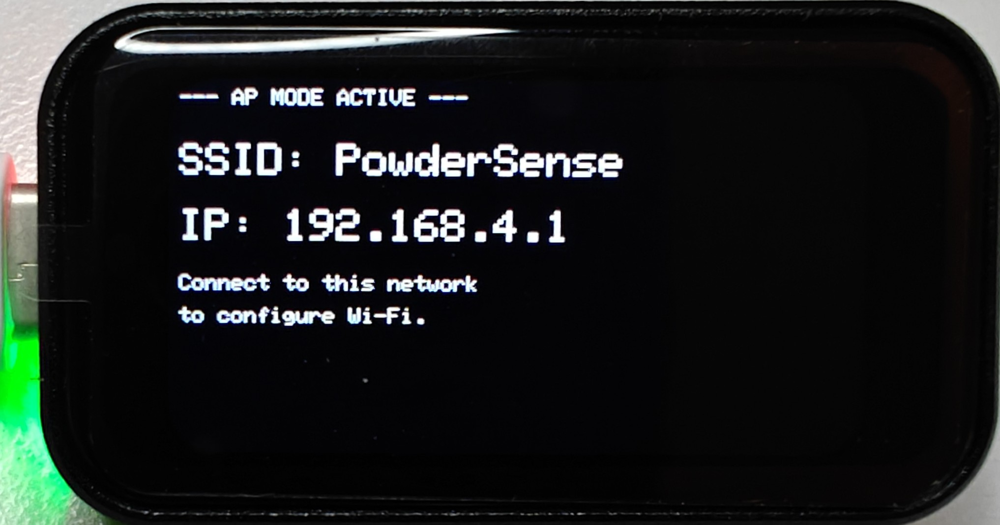

**When shown**: First boot or when no WiFi is configured

**Information displayed**:
- "AP MODE ACTIVE"
- WiFi network name: "PowderSense-XXXX"
- Password: "powdersense"
- IP address: http://192.168.4.1

**What to do**: Connect to the displayed WiFi network and configure your home WiFi via the web interface.

---

### 2. No Configuration

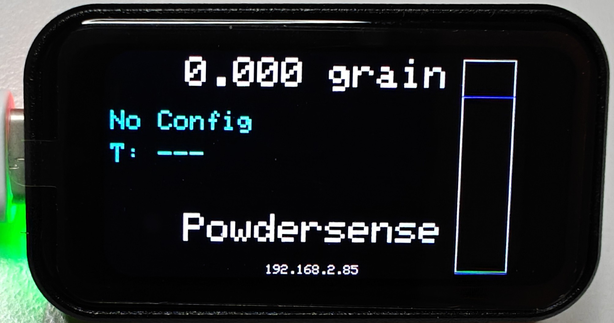

**When shown**: Device is connected to WiFi but no powder configuration is loaded

**Information displayed**:
- Current measurement: 0.000 grain
- Status: "No Config"
- IP address for web access

**What to do**: Access the web interface and create a powder configuration profile.

---

### 3. Measurement - LOW (Below Target)

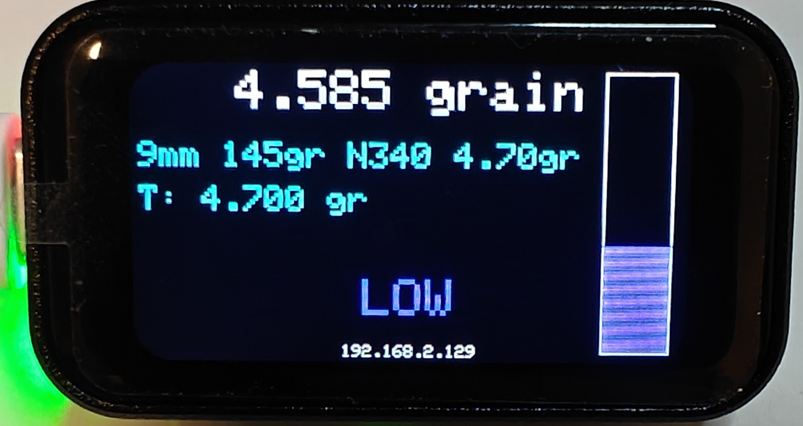

**When shown**: Measurement is below target weight

**Information displayed**:
- Current measurement: 4.585 grain
- Target weight: 4.700 grain
- Configuration: 9mm 145gr N340
- **Blue bar**: Indicates below target

**Meaning**: Add more powder to reach target weight.

---

### 4. Measurement - PERFECT (On Target)

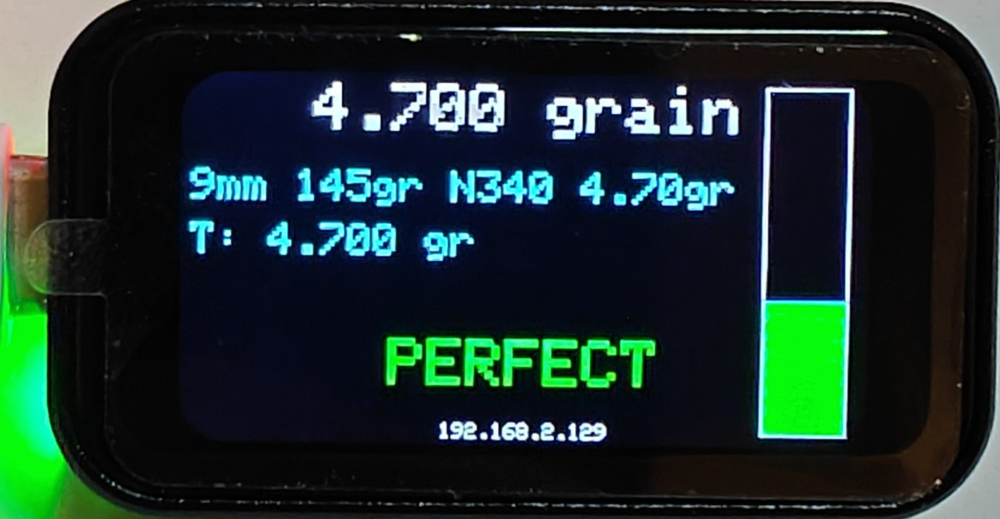

**When shown**: Measurement is within tolerance of target weight

**Information displayed**:
- Current measurement: 4.700 grain
- Target weight: 4.700 grain
- Configuration: 9mm 145gr N340
- **Green bar**: Indicates perfect measurement

**Meaning**: Powder charge is correct, proceed with loading.

---

### 5. Measurement - HIGH (Above Target)

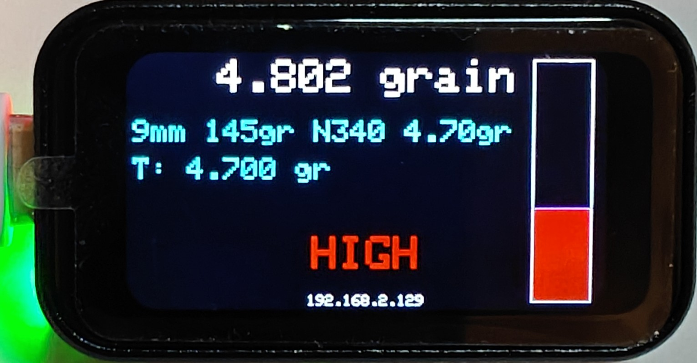

**When shown**: Measurement is above target weight

**Information displayed**:
- Current measurement: 4.802 grain
- Target weight: 4.700 grain
- Configuration: 9mm 145gr N340
- **Red bar**: Indicates above target (alarm)

**Meaning**: Remove powder to reach target weight. Red indicates out-of-spec condition.

---

## 🔧 First Time Setup

### Initial Power-On

When you first power on PowderSense:

1. **Self-Test**: Device performs hardware initialization
2. **Display Check**: Shows PowderSense splash screen
3. **WiFi Check**: Looks for saved WiFi credentials
4. **AP Mode**: If no WiFi configured, starts Access Point mode

### WiFi Configuration

**Connect to PowderSense AP**:
1. Look at display for network name (e.g., "PowderSense-A1B2")
2. On your device, connect to that WiFi network
3. Password: **powdersense**
4. Captive portal should open automatically
5. If not, navigate to: **http://192.168.4.1**

**Configure Home WiFi**:
1. Select your WiFi network from dropdown (or enter manually)
2. Enter your WiFi password
3. Click **"Save Configuration"**
4. Device reboots and connects to your network
5. Display shows new IP address

**Finding Your Device**:
- IP address is shown on the display
- Check your router's DHCP client list
- Use network scanner app (e.g., Fing, Advanced IP Scanner)

**Bookmark the IP address** in your browser for easy access!

---

## 📱 Web Interface

The web interface provides complete control over PowderSense. Access it by navigating to the IP address shown on the display.

### Dashboard

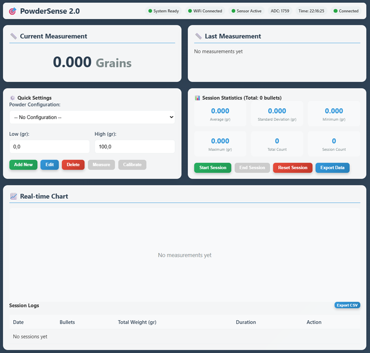

The main dashboard shows:

**Current Measurement Panel**:
- Large display of current weight in grains
- Updates in real-time (10 times per second)

**Last Measurement Panel**:
- Details of the last recorded measurement
- Timestamp and weight

**Quick Settings Panel**:
- Powder Configuration dropdown
- Low/High grain thresholds
- Buttons: Add New, Edit, Delete, Measure, Calibrate

**Session Statistics Panel**:
- Average, Standard Deviation, Minimum, Maximum
- Total Count, Session Count
- Buttons: Start Session, End Session, Reset Session, Export Data

**Real-time Chart**:
- Visual representation of measurements over time
- Shows last 100 measurements

**Session Logs Table**:
- Historical session data
- Date, bullet count, total weight, duration

---

## 🎯 Configuration & Calibration

### Creating a Configuration Profile

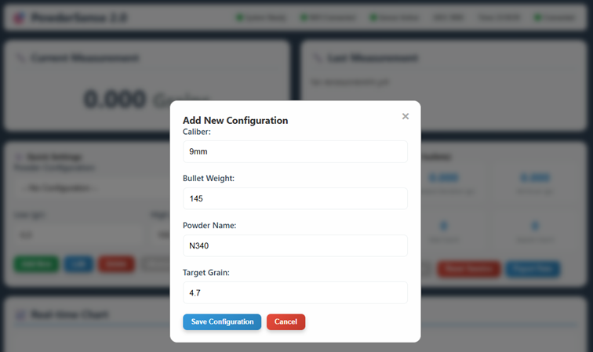

A configuration profile stores settings for a specific load:

1. Click **"Add New"** in Quick Settings panel
2. Fill in the dialog:
   - **Caliber**: Cartridge type (e.g., "9mm")
   - **Bullet Weight**: Projectile weight (e.g., "145")
   - **Powder Name**: Powder type (e.g., "N340")
   - **Target Grain**: Desired powder charge (e.g., "4.7")
3. Click **"Save Configuration"**

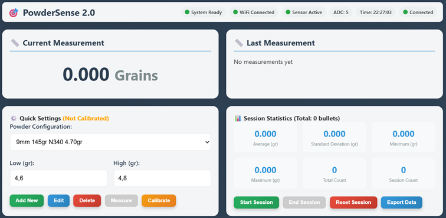

The configuration is now active but shows **"Not Calibrated"** in orange. You must calibrate before use.

### Calibration Process

**Why Calibrate?**

Each configuration must be calibrated because:
- Different powders have different densities
- Mechanical tolerances vary
- Temperature affects measurements
- Ensures accurate grain weight readings

**When to Calibrate**:
- After creating a new configuration
- When switching powder types
- If measurements seem inaccurate
- Weekly for frequent use, monthly for occasional use

**Calibration Steps**:

#### Step 1: Set Zero Point

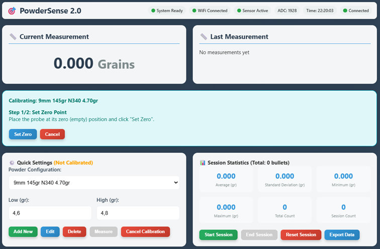

1. Click **"Calibrate"** button (orange)
2. Calibration wizard appears
3. **Fully extend the probe** (no compression)
4. Wait for reading to stabilize
5. Click **"Set Zero"** button
6. Confirmation: "Zero point set successfully"

#### Step 2: Set Known Reference

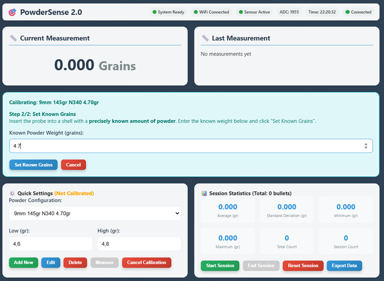

1. **Weigh powder precisely** on a scale (e.g., 4.7 grains)
2. **Place powder in case** and position under probe
3. **Insert probe** to measure depth
4. Wait for reading to stabilize (2-3 seconds)
5. **Enter exact weight** in "Known Powder Weight" field
6. Click **"Set Known Grains"** button
7. Device calculates conversion factor
8. Confirmation: "Calibration complete"

**Calibration Tips**:
- Use a precision scale for reference weight
- Use mid-range weight (not too light or heavy)
- Ensure stable environment (no vibration)
- Allow device to warm up (2-3 minutes)
- Wait for readings to stabilize before clicking buttons

---

## 🔬 Using PowderSense

### Active Measurement

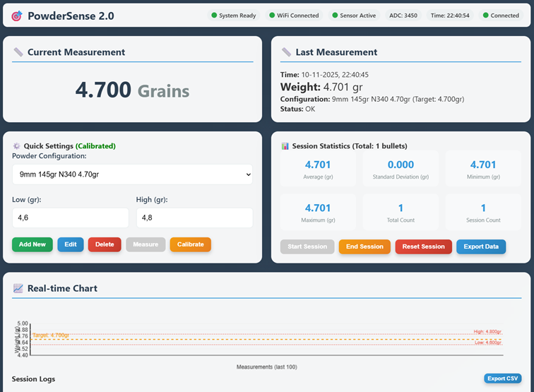

Once calibrated, PowderSense is ready to measure:

**Display Shows**:
- Current measurement in real-time
- Last measurement details (timestamp, weight, status)
- Configuration in use (shows "Calibrated" in green)
- Session statistics

**Workflow**:

1. **Dispense Powder**: Use your powder measure to dispense charge
2. **Position Case**: Place case under probe
3. **Insert Probe**: Probe compresses into powder
4. **Read Display**: Check physical display or web interface
5. **Adjust if Needed**: Add or remove powder based on color indicator
6. **Auto-Record**: When stable, measurement is automatically recorded
7. **Next Round**: Remove case and repeat

**Color Indicators**:
- **Blue**: Below target (add powder)
- **Green**: On target (perfect)
- **Red**: Above target (remove powder, alarm)

### Session Tracking

**Starting a Session**:
1. Click **"Start Session"** button
2. Session counter resets to 0
3. Begin measuring rounds

**During Session**:
- Each stable measurement increments counter
- Statistics update in real-time:
  - **Average**: Mean weight
  - **Std Dev**: Consistency indicator (lower is better)
  - **Min/Max**: Range of measurements
  - **Count**: Number of rounds measured

**Ending a Session**:
1. Click **"End Session"** button
2. Session is saved to log with:
   - Date and time
   - Bullet count
   - Total weight
   - Duration
3. Ready to start new session

**Exporting Data**:
- Click **"Export Data"** button
- Downloads CSV file with all measurements
- Open in Excel or Google Sheets for analysis

### Manual vs Auto-Measurement

**Auto-Measurement** (Default):
- System automatically detects stable readings
- When reading is stable for 750ms within ±0.1 grain tolerance, measurement is recorded
- 10-second cooldown prevents duplicate recordings
- Best for production reloading

**Manual Measurement**:
- Click **"Measure"** button to force recording
- Useful for testing or verification
- No automatic detection

---

## 🔧 Troubleshooting

### Display Issues

**Problem**: Display is blank
- Check USB-C power connection
- Try different power adapter (5V, >1A)
- Check for loose ribbon cable inside device

**Problem**: Display shows wrong values
- Perform calibration
- Check that correct configuration is selected
- Restart device (unplug and replug power)

### Measurement Issues

**Problem**: Readings are unstable or jumping
- Check for vibration or movement
- Ensure probe moves smoothly
- Check for mechanical binding
- Recalibrate

**Problem**: Measurements seem inaccurate
- Verify calibration with known weight
- Recalibrate using precision scale
- Check that correct configuration is active
- Ensure probe is fully inserted into powder

**Problem**: Device doesn't detect measurements
- Check auto-measurement settings (stable duration, tolerance)
- Ensure reading is actually stable
- Try manual measurement with "Measure" button

### WiFi Issues

**Problem**: Can't connect to PowderSense AP
- Check display for correct network name
- Verify password: "powdersense" (all lowercase)
- Move closer to device
- Restart device

**Problem**: Device won't connect to home WiFi
- Verify WiFi password is correct
- Check that WiFi is 2.4GHz (device doesn't support 5GHz)
- Ensure WiFi network is not hidden
- Try resetting WiFi configuration

**Problem**: Lost IP address
- Check display (IP is shown on screen)
- Check router DHCP client list
- Use network scanner to find device
- Reset to AP mode if needed

### Calibration Issues

**Problem**: Calibration fails or gives errors
- Ensure probe is stable during zero setting
- Use precise reference weight from scale
- Wait longer for readings to stabilize
- Try recalibrating with different reference weight

**Problem**: Calibration seems incorrect
- Verify reference weight on precision scale
- Use mid-range weight (not extreme low or high)
- Ensure powder is evenly distributed in case
- Check for mechanical issues with probe

---

## 🛠️ Maintenance & Safety

### Regular Maintenance

**Weekly** (for frequent use):
- Clean probe tip with soft brush
- Check probe movement is smooth
- Verify calibration accuracy

**Monthly**:
- Clean display with soft cloth
- Check all connections inside device
- Backup measurement data (export CSV)

**As Needed**:
- Recalibrate when switching powders
- Update firmware when available
- Replace worn components

### Cleaning

**Probe**:
- Use soft brush to remove powder residue
- Do not use solvents or lubricants
- Ensure probe moves freely

**Display**:
- Use soft, lint-free cloth
- Slightly damp if needed
- Do not use harsh chemicals

**Enclosure**:
- Wipe with damp cloth
- Keep away from powder dust
- Ensure ventilation holes are clear

### Safety Information

**Electrical Safety**:
- Use only 5V DC power supply
- Do not expose to water or liquids
- Unplug during cleaning or maintenance
- Do not open device while powered

**Reloading Safety**:
- **Always verify charges with precision scale**
- PowderSense is a measurement aid, not a replacement for safe reloading practices
- Follow published load data
- Never exceed maximum loads
- Use appropriate safety equipment

**Important**: PowderSense measures powder depth and converts to grain weight based on calibration. Accuracy depends on proper calibration and consistent powder density. Always verify critical measurements with a precision scale.

### Firmware Updates

**Checking Version**:
- Current version shown in web interface
- Check GitHub for latest release: https://github.com/me-processware/powdersense

**Updating Firmware**:
- Download latest firmware from GitHub releases
- Follow flashing instructions in releases/v1.0/FLASHING.md
- Requires USB connection and esptool.py or PlatformIO
- Calibration data is preserved during updates

---

## 📞 Support & Resources

### Documentation

- **GitHub Repository**: https://github.com/me-processware/powdersense
- **Assembly Guide**: docs/ASSEMBLY.md
- **Bill of Materials**: docs/BOM.md
- **Flashing Guide**: releases/v1.0/FLASHING.md

### Getting Help

**For Technical Issues**:
- GitHub Issues: Report bugs or problems
- GitHub Discussions: Ask questions, share tips

**For Pre-Built Units**:
- Email: info@processware.nl
- 1 year warranty on assembled units
- Support for setup and calibration

### Community

- Share your builds and modifications
- Contribute improvements via pull requests
- Help other users in GitHub Discussions
- Post photos with #PowderSense

---

**User Manual by Processware - November 2025**  
*Part of the PowderSense Open Source Project*

**Stay Safe. Reload Responsibly.** 🎯
