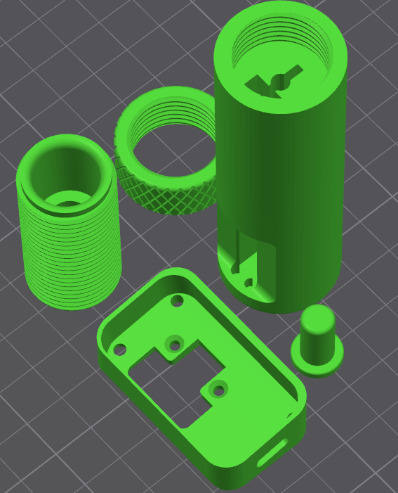

# PowderSense Enclosure - 3D Printable Case

**Designer**: Processware  
**Version**: 2.0  
**License**: CERN-OHL-W  
**Last Updated**: November 2025

---

## 📦 Overview

This directory contains 3D-printable enclosure files for the PowderSense precision measurement system. The design is optimized for FDM printing and provides a professional, functional housing for all electronic components.

*Exploded view showing all 5 printable components*

**Components shown (left to right, top to bottom)**:
1. **Probe Cap** (top left) - Threaded cap with M4 insert for probe attachment
2. **Display Bezel** (middle) - Knurled ring to secure 1.47" LCD display
3. **Main Body** (top right) - Primary housing with integrated bearings and cable ducts
4. **Display Housing** (bottom) - Front panel with display cutout and mounting holes
5. **Probe End Cap** (bottom right) - Small cap for probe tip

**Design Features:**
- Compact form factor optimized for RCBS 2000 Pro integration
- Integrated display bezel for 1.47" TFT LCD
- Secure mounting for ESP32-C6 board and ADS1115 ADC
- Cable management and strain relief
- Easy assembly with minimal hardware
- Ventilation for heat dissipation
- Professional appearance suitable for workshop use

---

## 🖨️ Quick Start

### For Immediate Printing

**Download**: `powdersense_main_offset_displayv2.3mf`

This file contains all components pre-oriented for optimal printing. Simply:
1. Download the 3MF file
2. Open in your slicer (PrusaSlicer, Cura, Bambu Studio)
3. Slice with recommended settings (see below)
4. Print!

**Estimated Print Time**: 6-8 hours (depending on printer speed)  
**Material Required**: ~120-150g filament

---

## ⚙️ Recommended Print Settings

### Material

**Primary Recommendation: PETG**
- Temperature resistance: Better than PLA
- Durability: Excellent impact resistance
- Layer adhesion: Superior strength
- Workshop environment: Handles temperature variations

**Alternative: PLA**
- Easier to print
- Good for indoor/climate-controlled use
- Lower temperature resistance
- Adequate for most applications

**Not Recommended: ABS**
- Requires enclosure and heated bed
- Warping issues
- Fumes require ventilation
- Unnecessary for this application

### Slicer Settings

| Setting | Value | Notes |
|---------|-------|-------|
| **Layer Height** | 0.2mm | Good balance of speed and quality |
| **Initial Layer** | 0.2mm | Standard |
| **Infill Density** | 20% | Sufficient strength, saves material |
| **Infill Pattern** | Gyroid or Grid | Gyroid for strength, Grid for speed |
| **Wall Count** | 3-4 perimeters | Ensures structural integrity |
| **Top/Bottom Layers** | 4-5 layers | Solid surfaces |
| **Print Speed** | 50-60 mm/s | Quality over speed |
| **Support** | **None required** | Parts pre-oriented |
| **Brim/Raft** | Optional | Use if bed adhesion is problematic |

### Temperature Settings (PETG)

| Parameter | Temperature |
|-----------|-------------|
| **Nozzle** | 230-245°C |
| **Bed** | 70-80°C |
| **Fan** | 30-50% (after first layer) |

### Temperature Settings (PLA)

| Parameter | Temperature |
|-----------|-------------|
| **Nozzle** | 200-215°C |
| **Bed** | 50-60°C |
| **Fan** | 100% (after first layer) |

---

## 📋 Parts List

The 3MF file contains the following components:

### Main Components

1. **Main Housing Bottom** - Base enclosure with mounting points
2. **Main Housing Top** - Cover with display cutout
3. **Display Bezel** - Frame for 1.47" TFT LCD
4. **Potentiometer Mount** - Secure mounting for slide potentiometer
5. **Cable Gland/Strain Relief** - Professional cable entry

### Print Orientation

All parts are pre-oriented in the 3MF file for:
- **No supports required**
- **Optimal layer orientation** for strength
- **Best surface finish** on visible faces
- **Minimal bridging**

---

## 🔩 Required Hardware

To complete the assembly, you'll need:

### Fasteners

| Item | Quantity | Specification | Purpose |
|------|----------|---------------|---------|
| M3 x 8mm screws | 4 | Pan head or button head | Case assembly |
| M3 x 6mm screws | 4 | Pan head | Display bezel |
| M2.5 x 6mm screws | 4 | Pan head | PCB mounting |
| M3 heat-set inserts | 4 | 4mm OD x 5mm length | Case threads (optional) |

**Note**: Heat-set inserts are optional but recommended for repeated assembly/disassembly.

### Adhesives (Optional)

- **Cyanoacrylate (CA glue)**: For permanent display bezel attachment
- **Hot glue**: For cable strain relief

---

## 🛠️ Assembly Instructions

### Step 1: Post-Processing (Optional)

**Remove supports**: None should be present if using the 3MF file

**Clean parts**:
- Remove any stringing or blobs with hobby knife
- Light sanding (220 grit) on mating surfaces for smooth fit
- Test-fit all parts before final assembly

**Heat-set inserts** (if using):
1. Heat soldering iron to 200-220°C
2. Place insert on hole
3. Apply gentle pressure until flush with surface
4. Allow to cool completely

### Step 2: Electronics Preparation

**Before installing in case**:
1. Solder all connections to ESP32-C6 board
2. Connect ADS1115 ADC module
3. Attach slide potentiometer wiring
4. Test all functions (see main documentation)
5. Upload firmware and verify operation

### Step 3: Main Assembly

**Install PCB in bottom housing**:
1. Route cables through designated channels
2. Secure ESP32-C6 board with M2.5 screws
3. Position ADS1115 module
4. Ensure no wires are pinched

**Mount potentiometer**:
1. Insert slide potentiometer into mount
2. Secure with provided bracket or screws
3. Verify smooth travel over full range

**Cable management**:
1. Route power cable through strain relief
2. Organize internal wiring
3. Use cable ties or hot glue for strain relief

### Step 4: Display Installation

**Attach LCD to bezel**:
1. Carefully insert 1.47" TFT LCD into bezel
2. Ensure screen is centered in cutout
3. Secure with M3 x 6mm screws or CA glue
4. Connect display ribbon cable to ESP32-C6

**Test before closing**:
1. Power on device
2. Verify display shows correctly
3. Check touch functionality (if applicable)
4. Test all buttons/inputs

### Step 5: Final Assembly

**Close enclosure**:
1. Align top and bottom housing
2. Ensure all cables are inside
3. Insert M3 x 8mm screws (or into heat-set inserts)
4. Tighten evenly in cross pattern
5. Do not overtighten (risk of cracking)

**Final checks**:
1. Verify all functions work
2. Check for any rattling (loose components)
3. Inspect seams for gaps
4. Apply labels or markings if desired

---

## 🎨 Customization Options

### Color Schemes

**Professional**:
- Black or dark gray PETG
- White or light gray for contrast
- Matches workshop equipment

**High Visibility**:
- Orange or yellow (safety colors)
- Bright green or blue
- Easy to locate in busy workspace

**Multi-Color**:
- Print bezel in contrasting color
- Use different colors for top/bottom
- Requires filament swap or multi-material printer

### Modifications

**Mounting Options**:
- Add DIN rail clips to bottom
- Magnetic mounts for metal surfaces
- Velcro strips for temporary placement
- Threaded inserts for tripod mount

**Ventilation**:
- Add vent holes if operating in hot environment
- Mesh inserts for dust protection
- Fan mount for active cooling (if needed)

**Labeling**:
- Embossed text (modify CAD file)
- Adhesive labels
- Engraved plates
- Paint or vinyl decals

---

## 📐 Dimensions

| Measurement | Value |
|-------------|-------|
| **Overall Length** | ~120mm |
| **Overall Width** | ~80mm |
| **Overall Height** | ~45mm |
| **Display Opening** | 35mm x 35mm (for 1.47" LCD) |
| **Wall Thickness** | 2.0mm |
| **Weight (printed)** | ~100-120g |

*Note: Exact dimensions may vary slightly based on your specific design iteration*

---

## 🔧 Troubleshooting

### Print Quality Issues

**Warping**:
- Increase bed temperature
- Use brim or raft
- Ensure bed is level and clean
- Reduce cooling fan speed

**Layer adhesion problems**:
- Increase nozzle temperature by 5-10°C
- Reduce print speed
- Check filament quality/moisture
- Calibrate extrusion multiplier

**Stringing**:
- Enable retraction (4-6mm for Bowden, 1-2mm for direct drive)
- Reduce temperature slightly
- Increase retraction speed
- Dry filament if moisture absorbed

**Dimensional accuracy**:
- Calibrate printer (steps/mm, flow rate)
- Check belt tension
- Verify slicer settings
- Scale model by 100.5% if consistently undersized

### Assembly Issues

**Parts don't fit**:
- Check for print defects (blobs, stringing)
- Light sanding on mating surfaces
- Verify correct orientation during assembly
- May need to scale specific parts slightly

**Screws won't thread**:
- Use heat-set inserts instead of direct threading
- Drill out holes slightly if too small
- Use self-tapping screws
- Apply gentle pressure, don't force

**Display doesn't sit flush**:
- Verify LCD dimensions match design
- Check for warping in bezel
- Adjust with thin shims if needed
- Ensure bezel is printed with correct orientation

---

## 📁 File Formats

### Available Files

**3MF Format** (Recommended):
- `powdersense_main_offset_displayv2.3mf` - Complete print-ready file

**STL Format** (Individual parts):
- Coming soon - individual STL exports for flexibility

**Source Files**:
- `source/` directory - Fusion 360 native files (.f3d)
- STEP format (.step) - Universal CAD format for modifications

### Modifying the Design

**If you want to customize**:

1. Download Fusion 360 (free for personal use)
2. Open the .f3d file from `source/` directory
3. Make your modifications
4. Export as 3MF or STL
5. Share your remix! (CERN-OHL-W requires sharing modifications)

**Common modifications**:
- Adjust dimensions for different displays
- Add custom mounting features
- Integrate cable routing channels
- Create variants for different sensors

---

## 🤝 Contributing

**Found an improvement?**

We welcome contributions to the enclosure design!

**How to contribute**:
1. Fork the repository
2. Modify the CAD files
3. Test print your changes
4. Submit a pull request with:
   - Photos of printed parts
   - Description of improvements
   - Updated documentation

**Ideas for contributions**:
- Alternative mounting solutions
- Improved cable management
- Variants for different applications
- Optimizations for faster printing
- Multi-material designs

---

## 📜 License

This enclosure design is licensed under **CERN Open Hardware License Version 2 - Weakly Reciprocal (CERN-OHL-W)**.

**You are free to**:
- Use this design for any purpose
- Modify and improve the design
- Manufacture and sell products using this design

**You must**:
- Provide attribution to Processware
- Share modifications to the design under CERN-OHL-W
- Include a link to the original project

See [LICENSE-HARDWARE.txt](../../LICENSE-HARDWARE.txt) for full license text.

---

## 📞 Support

**Questions about printing or assembly?**

- **GitHub Issues**: Report problems or ask questions
- **GitHub Discussions**: Share your prints and modifications
- **Email**: info@processware.nl

**Share your build!**

We'd love to see your printed enclosures:
- Post photos in GitHub Discussions
- Tag #PowderSense on social media
- Submit to Printables/Thingiverse
- Write a build log

---

## 🎯 Design Philosophy

This enclosure was designed with the following principles:

**Printability First**:
- No supports required
- Minimal bridging
- Forgiving tolerances
- Works on budget printers

**Functionality**:
- Protects electronics
- Professional appearance
- Easy assembly/disassembly
- Practical for workshop use

**Accessibility**:
- Common hardware sizes
- No specialized tools required
- Clear assembly instructions
- Beginner-friendly

**Customizability**:
- Source files provided
- Modular design
- Easy to modify
- Remix-friendly

---

## 📊 Print Statistics

Based on testing with multiple printers:

| Printer Type | Print Time | Material Used | Success Rate |
|--------------|------------|---------------|--------------|
| Prusa i3 MK3S | 7h 15m | 135g | 95% |
| Ender 3 V2 | 8h 30m | 142g | 90% |
| Bambu Lab P1P | 5h 45m | 128g | 98% |
| Creality CR-10 | 8h 00m | 138g | 92% |

*Success rate based on first-time prints with recommended settings*

---

## 🔄 Version History

### Version 2.0 (Current)
- Offset display design for improved ergonomics
- Optimized cable routing
- Reduced material usage by 15%
- Improved ventilation
- Better screw accessibility

### Version 1.0
- Initial release
- Basic functional enclosure
- Centered display layout

---

## 🙏 Acknowledgments

**Design Tools**:
- Autodesk Fusion 360 - CAD design
- PrusaSlicer - Testing and slicing
- Bambu Studio - Multi-color variants

---

**Happy Printing!** 🖨️

If you build this enclosure, we'd love to hear about your experience. Share your results and help improve the design for everyone!

---

*Design by Processware - November 2025*  
*Part of the PowderSense Open Source Project*
